# Arquitectura — Pixel MVP 0.1

Monolito modular en un monorepo con npm workspaces. Un frontend SPA, una API REST y un paquete de
contratos compartido. Sin microservicios, sin colas externas, sin servicios adicionales a MongoDB.

---

## 1. Vista general

```mermaid
flowchart TB
  subgraph Browser
    WEB["apps/web<br/>React + Vite + Tailwind<br/>React Three Fiber + Drei"]
  end
  subgraph Server["apps/api (proceso Node único)"]
    HTTP[Express routes + middleware]
    MOD[Módulos de dominio<br/>auth · companies · brand · avatar · chat · memory]
    AI["ai/<br/>AIProvider + adaptadores + prompts"]
    JOB[Jobs en proceso<br/>análisis de marca]
  end
  CONTRACTS[["packages/contracts<br/>Zod schemas + tipos"]]
  DB[(MongoDB)]
  LLM[(Proveedor IA externo)]

  WEB -- "/api (JSON, cookie httpOnly)" --> HTTP
  HTTP --> MOD
  MOD --> JOB
  MOD --> AI
  JOB --> AI
  MOD --> DB
  AI --> LLM
  WEB -. importa .-> CONTRACTS
  HTTP -. importa .-> CONTRACTS
  AI -. valida salidas con .-> CONTRACTS
```



## 2. Estructura del monorepo

```
/
├─ package.json              # workspaces + scripts raíz (dev, build, typecheck, lint, test)
├─ tsconfig.base.json        # strict, ESM, NodeNext / Bundler según workspace
├─ eslint.config.js          # flat config + typescript-eslint
├─ .prettierrc
├─ .nvmrc
├─ apps/
│  ├─ api/
│  │  ├─ .env.example
│  │  ├─ src/
│  │  │  ├─ server.ts                 # bootstrap: env, conexión DB (con reintentos), listen, apagado limpio
│  │  │  ├─ app.ts                    # createApp(): Express sin efectos (usable en tests)
│  │  │  ├─ config/env.ts             # variables de entorno validadas con Zod
│  │  │  ├─ lib/
│  │  │  │  ├─ logger.ts              # logger mínimo: pretty en dev, JSON por línea en producción
│  │  │  │  └─ errors.ts              # AppError + helpers (notFound, badRequest, ...)
│  │  │  ├─ db/
│  │  │  │  ├─ connection.ts          # startDatabase / stopDatabase / getDatabaseStatus
│  │  │  │  └─ tenantScoped.plugin.ts # exige companyId en queries de modelos de empresa
│  │  │  ├─ middleware/
│  │  │  │  ├─ requestLogger.ts       # requestId (X-Request-Id) + log por petición
│  │  │  │  ├─ notFound.ts
│  │  │  │  ├─ errorHandler.ts        # errores → ApiError de contracts
│  │  │  │  ├─ requireAuth.ts         # (Etapa 3)
│  │  │  │  ├─ requireCompanyAccess.ts# (Etapa 4)
│  │  │  │  └─ validate.ts            # (Etapa 3) valida body/params/query con schemas de contracts
│  │  │  ├─ modules/
│  │  │  │  ├─ index.ts           # registro único de módulos y sus rutas
│  │  │  │  ├─ health/            GET /api/health
│  │  │  │  ├─ auth/              user.model · auth.service · auth.routes
│  │  │  │  ├─ companies/         company.model · company.service · companies.routes (+ onboarding)
│  │  │  │  ├─ brand-dna/         brandDna.model · brandDna.service · brandDna.generator · brandDna.lexicon · brand-dna.routes
│  │  │  │  ├─ avatars/           avatarProfile.model · avatar.service · avatars.routes · engine/ (interfaz, catálogo, reglas)
│  │  │  │  ├─ conversations/     conversation.model · message.model · contextBuilder · pixelChat.service · conversations.routes
│  │  │  │  └─ creative-memory/   creativeMemory.model · creativeMemory.service · creative-memory.routes
│  │  │  └─ ai/
│  │  │     ├─ AIProvider.ts           # interfaz
│  │  │     ├─ structured.ts           # generateObject + validación Zod + 1 reintento
│  │  │     ├─ providers/mock.provider.ts
│  │  │     ├─ providers/<real>.provider.ts
│  │  │     ├─ prompts/brandAnalysis.prompt.ts
│  │  │     ├─ prompts/avatarDesign.prompt.ts
│  │  │     ├─ prompts/pixelChat.prompt.ts
│  │  │     └─ index.ts                # createAIProvider(env)
│  │  └─ test/
│  └─ web/
│     ├─ .env.example · vite.config.ts (proxy /api)
│     └─ src/
│        ├─ main.tsx · index.css (tokens de tema Tailwind)
│        ├─ app/                       # router, AppShell, Sidebar, Header, navigation
│        ├─ components/                # Icon, PixelMark, PageHeader, EmptyState (sin librería de UI)
│        ├─ lib/api.ts                 # cliente fetch tipado, valida respuestas con contracts
│        └─ features/
│           ├─ auth/        LoginPage (+ RegisterPage, AuthProvider en Etapa 3)
│           ├─ dashboard/   DashboardPage
│           ├─ companies/   CompaniesPage · CompanyOverviewPage (+ onboarding en Etapa 4)
│           ├─ brand/       BrandPage (+ AnalysisPage, BrandDnaSummary)
│           ├─ pixel/       PixelPage (+ PixelAvatar, archetypes, profileToScene, AvatarRationale)
│           ├─ chat/        ChatPage (+ MessageList, Composer, MemoryPanel)
│           └─ system/      ApiStatus · useApiHealth · NotFoundPage
├─ packages/
│  └─ contracts/
│     └─ src/
│        ├─ common.ts       # ObjectId (string), HexColor, timestamps, paginación
│        ├─ errors.ts       # ApiError { code, message, details? }
│        ├─ auth.ts · user.ts · company.ts · onboarding.ts
│        ├─ brandDna.ts · avatarProfile.ts
│        ├─ chat.ts · memory.ts
│        └─ index.ts
└─ docs/
```

### Notas de build

- Todo el monorepo es **ESM** (`"type": "module"`).
- `packages/contracts` se compila con `tsc` a `dist/` (con `.d.ts`). `apps/api` y `apps/web` lo
  consumen como dependencia de workspace (`"@pixel/contracts": "*"`). En `dev`, `tsc --watch` de
  contracts corre en paralelo.
- `apps/api`: `tsx watch` en desarrollo, `tsc` para build.
- `apps/web`: Vite; proxy `/api → http://localhost:<API_PORT>` en desarrollo (mismo origen → cookies simples, sin CORS en dev).
- `contracts` **solo** depende de `zod`. Nunca importa Mongoose, Express ni React.

## 3. Capas del backend

| Capa | Responsabilidad | Regla |
|---|---|---|
| Routes | HTTP: parseo, validación (`validate` + schema de contracts), código de estado | Sin lógica de negocio ni acceso directo a modelos |
| Middleware | `requireAuth` (JWT de cookie → `req.user`), `requireCompanyAccess` (`req.company`) | Toda ruta `/api/companies/:companyId/*` usa ambos |
| Services | Lógica de dominio. Firma con `companyId` explícito: `service.method(companyId, ...)` | No conocen Express. No conocen el SDK de IA |
| Models | Schemas Mongoose + índices + plugin `tenantScoped` | Convierten a DTO de contracts antes de salir (`toDTO`) |
| `ai/` | Proveedores, prompts, salida estructurada | Único lugar donde se importan SDKs de IA (regla ESLint `no-restricted-imports`) |

## 4. Aislamiento multiempresa (tenant isolation)

Defensa en capas — basta con que una falle para que otra lo detenga:

1. **Ruta**: recursos de empresa siempre bajo `/api/companies/:companyId/...`.
2. **Middleware** `requireCompanyAccess`: carga `Company` con `{ _id: companyId, ownerId: req.user.id }`.
   Si no existe → `404 COMPANY_NOT_FOUND`. Expone `req.company`.
3. **Servicios**: `companyId` es el primer parámetro; jamás se toma del body.
4. **Consultas**: siempre `{ companyId, ... }`; para un documento concreto, `{ _id, companyId }`.
5. **Plugin `tenantScoped`**: hooks `pre` de `find*`, `count*`, `update*`, `delete*` y `aggregate` lanzan
   error si el filtro no contiene `companyId`. En `save`, `companyId` es requerido por schema.
6. **Contexto de IA**: `ContextBuilder.build(companyId, conversationId)` solo lee de colecciones de esa
   empresa. Los prompts nunca incluyen datos de otra empresa; por construcción, ni una inyección de
   prompt puede exponer información ajena porque no está en el contexto.
7. **Tests**: suite dedicada "isolation" con dos usuarios y dos empresas que prueba cada endpoint
   (lectura y escritura cruzada → 404) y el contenido del contexto de IA.

## 5. Capa de IA

> **Estado actual:** aún no hay IA. El BrandDNA se genera con reglas determinísticas
> (`brandDna.generator.ts`) para validar la arquitectura de punta a punta. El servicio de IA
> (`BrandAnalysisService`) producirá el mismo contrato `BrandDnaContentSchema`, así que el resto del
> producto no cambia al activarla.

### 5.1 Interfaz

```ts
// apps/api/src/ai/AIProvider.ts
export interface AIChatTurn { role: 'user' | 'assistant'; content: string }

export interface AIUsage { inputTokens?: number; outputTokens?: number }

export interface AIProvider {
  readonly name: string;   // 'mock' | 'anthropic' | ...
  readonly model: string;

  /** Respuesta de texto libre (chat). */
  generateText(input: {
    system: string;
    messages: AIChatTurn[];
    maxTokens?: number;
    temperature?: number;
  }): Promise<{ text: string; usage?: AIUsage }>;

  /** Respuesta JSON cruda; la validación la hace generateObject() en structured.ts. */
  generateJson(input: {
    system: string;
    prompt: string;
    jsonSchema: Record<string, unknown>; // derivado del schema Zod
    maxTokens?: number;
  }): Promise<{ json: unknown; usage?: AIUsage }>;
}
```

```ts
// apps/api/src/ai/structured.ts
generateObject<T>(provider, { system, prompt, schema: ZodType<T>, schemaName }): Promise<T>
// 1. pide JSON al proveedor  2. valida con Zod
// 3. si falla, 1 reintento incluyendo los errores de validación  4. si vuelve a fallar → AIOutputError
```

### 5.2 Servicios de dominio sobre la IA

| Servicio | Entrada | Salida | Notas |
|---|---|---|---|
| `BrandAnalysisService` | `companyId`, `BrandOnboardingInput` | `BrandDNA` (validado) | Prompt versionado (`promptVersion`) guardado en el documento |
| `AvatarConceptEngine` (✅ reglas `avatar-rules-1`; IA pendiente) | `BrandDNA`, `variation` | `AvatarConcept` (validado) | **Solo recibe el BrandDNA**. Valores visuales de catálogos cerrados que el renderer conoce. Devuelve `rationale` con fuentes. Ver `ENTITIES.md §4` |
| `PixelChatService` | `companyId`, `conversationId`, mensaje del usuario | Mensaje de Pixel | System prompt = rol de director creativo + BrandDNA + memorias activas; historial de últimos N mensajes |

### 5.3 Selección de proveedor

- `AI_PROVIDER=mock|<real>` y `AI_MODEL=<id>` en `.env`. `createAIProvider(env)` devuelve la implementación.
- `MockAIProvider`: determinista, sin red. Deriva BrandDNA/AvatarProfile plausibles del input
  (p. ej. palabras clave "café" → `seed`, "tecnología" → `crystal`, "construcción" → `block`) para
  poder recorrer el flujo completo en dev y en tests.
- Las claves de API viven solo en el backend.

## 6. Avatar 3D (renderer paramétrico) ✅

No se generan mallas con IA. El avatar se **compone** en el cliente con primitivas y geometrías
procedurales de Three.js (React Three Fiber + Drei) a partir del `AvatarProfile`. Tres capas
separadas (`apps/web/src/features/avatar3d/`):

```
BrandDNA ──(API: Avatar Concept Engine, reglas de negocio)──▶ AvatarProfile
AvatarProfile ──profileToScene() (traducción visual pura)──▶ SceneSpec
estado + tiempo ──poseAt() (función pura)──▶ Pose objetivo

<PixelAvatar profile state>                Canvas, cámara responsiva, controles limitados
 ├─ <AvatarEnvironment>                    luces, sombras, environment procedural (Lightformers)
 └─ <PresentationControls snap>            giro acotado que vuelve solo al frente; sin zoom ni pan
     └─ <AvatarController>                 interpola la pose (damp) y la aplica cada frame
         ├─ <AvatarBody>                   seed | crystal | block | blob | drop | capsule (+ ranura, líneas)
         ├─ <AvatarFace>                   <AvatarEyes> <AvatarMouth> + rubor
         ├─ <AvatarLimbs>                  brazos y piernas (mano con accesorio)
         ├─ <AvatarAccessory>              hoja, taza, anillo orbital, casco, insignia
         └─ <ThinkingDots>
```

- **Sin reglas de negocio en Three.js**: los componentes solo leen `SceneSpec` y la pose.
  `profileToScene` y `poseAt` se testean sin WebGL.
- **Estados**: `idle` (movimiento sutil según `idleBehavior` + parpadeo y mirada),
  `thinking` (mira arriba, mano a la barbilla, puntos), `listening` (se inclina, asiente),
  `speaking` (boca con aperturas tipo sílaba y pausas, gestos de cabeza y brazos; **no** es
  lip-sync), `happy` (salta, brazos arriba, ojos en arco). Las transiciones se interpolan.
  La expresividad y la energía del perfil escalan amplitud y velocidad.
- En `/pixel`: "Pensando" mientras se genera el concepto y "Feliz" al recibirlo. En desarrollo
  aparece un controlador manual de estados (`import.meta.env.DEV`).
- **Cámara**: encuadra al personaje completo calculando la distancia por alto y por ancho del
  lienzo (escritorio y móvil). `PresentationControls` en vez de OrbitControls: rotación acotada
  (±43° horizontal, poca vertical) con retorno automático al frente.
- **Rendimiento**: `dpr` máx. 1,75, sombras PCF de 1024 px + ContactShadows, sin HDRI externos.
  El renderer se carga con `React.lazy` (paquete aparte, ~280 kB gzip, solo en `/pixel`).
- **Fallback**: sin WebGL o si la escena falla (ErrorBoundary) se muestra la vista SVG provisional.

## 7. API REST

Prefijo `/api`. JSON. Errores con forma `ApiError { code, message, details? }`.

| Método | Ruta | Descripción |
|---|---|---|
| GET | `/health` | Salud del servicio y de la conexión a DB |
| POST | `/auth/register` | Crea usuario, inicia sesión |
| POST | `/auth/login` | Inicia sesión (cookie httpOnly) |
| POST | `/auth/logout` | Cierra sesión |
| GET | `/auth/me` | Usuario actual |
| GET | `/companies` | Empresas del usuario |
| POST | `/companies` | Crear empresa |
| GET | `/companies/:companyId` | Empresa + estado del análisis |
| PATCH | `/companies/:companyId` | Actualizar `name`, `industry`, `description`, `logoUrl` (slug y estado no editables) |
| GET | `/companies/:companyId/brand-dna` | Progreso del onboarding (respuestas, pasos completos) + BrandDNA vigente ✅ |
| PUT | `/companies/:companyId/brand-dna` | Guarda un paso `{ step, data }`; con los 8 pasos completos (re)genera el BrandDNA ✅ |
| POST | `/companies/:companyId/onboarding/submit` | (Etapa 6, con IA) Lanzar análisis asíncrono (`202`) |
| POST | `/companies/:companyId/analysis/retry` | Reintentar/regenerar análisis (`202`) |
| GET | `/companies/:companyId/avatar` | Avatar vigente, historial (máx. 20) e `isStale` ✅ |
| POST | `/companies/:companyId/avatar/generate` | Crea/regenera el concepto (nueva versión, `201`); `409` sin BrandDNA ✅ |
| GET | `/companies/:companyId/conversations` | Conversaciones |
| POST | `/companies/:companyId/conversations` | Nueva conversación |
| GET | `/companies/:companyId/conversations/:conversationId/messages` | Mensajes |
| POST | `/companies/:companyId/conversations/:conversationId/messages` | Enviar mensaje → `{ userMessage, pixelMessage }` |
| GET | `/companies/:companyId/memories` | Memorias activas |
| POST | `/companies/:companyId/memories` | Crear memoria |
| DELETE | `/companies/:companyId/memories/:memoryId` | Desactivar memoria |

## 8. Procesamiento asíncrono del análisis

- `submit` cambia `status → analyzing`, responde `202` y ejecuta el job **en el mismo proceso**
  (promesa no bloqueante con manejo de errores). Sin colas externas.
- El job: BrandDNA → guarda → AvatarProfile → guarda → `status = ready` (o `failed` con `analysis.error`).
- Protección de concurrencia: `submit`/`retry` usan una actualización condicional
  (`status ≠ analyzing`) para no lanzar dos análisis a la vez.
- Recuperación: al arrancar, empresas en `analyzing` con `analysis.startedAt` más antiguo que
  `ANALYSIS_TIMEOUT_MS` → `failed`.
- El frontend hace polling a `GET /companies/:companyId` cada 2 s mientras `status = analyzing`.

## 9. Seguridad

- Contraseñas con `bcryptjs` (bcrypt en JS puro, sin compilación nativa; coste `BCRYPT_ROUNDS`, 12 por defecto). Email normalizado a minúsculas.
- Sesión: JWT HS256 (`sub` = userId, expira en `SESSION_TTL_DAYS`) en la cookie `pixel_session`
  `httpOnly`, `SameSite=Lax`, `Secure` en producción. El token nunca va en el cuerpo ni en localStorage.
  `POST /auth/logout` borra la cookie.
- Login: mismo mensaje y tiempo de respuesta similar (hash ficticio) si el email no existe o la contraseña falla.
- `originGuard`: las mutaciones con un `Origin` fuera de `CORS_ORIGINS` → 403 (defensa CSRF junto con `SameSite`).
- `requireAuth` → `req.auth.userId`; `requireCompanyAccess` → `req.company` (consulta `{ _id, ownerId }`;
  id malformado, inexistente o ajeno → el mismo 404).
- `JWT_SECRET` es obligatorio en producción; en desarrollo se usa uno de desarrollo con aviso en el log.
- Validación Zod de todo input; límites de tamaño de body y de longitud de campos del onboarding y mensajes.
- `helmet` no es imprescindible en 0.1; rate limiting de login queda en backlog (riesgo aceptado para el MVP).
- Nunca se loguean contraseñas, tokens ni prompts completos con datos de la empresa en producción.

## 10. Configuración

Cada app tiene su `.env` (ignorado por git) y su `.env.example` versionado.

`apps/api/.env`:

```
NODE_ENV=development
PORT=4000
MONGODB_URI=mongodb://127.0.0.1:27017/pixel
CORS_ORIGINS=http://localhost:5173
LOG_LEVEL=info
JWT_SECRET=            # ≥ 32 caracteres; obligatorio en producción
SESSION_TTL_DAYS=7
BCRYPT_ROUNDS=12
# Se añaden en etapas posteriores: AI_PROVIDER / AI_MODEL / AI_API_KEY (5),
# ANALYSIS_TIMEOUT_MS (6), CHAT_HISTORY_LIMIT (8)
```

`apps/web/.env`:

```
VITE_API_URL=                               # vacío = mismo origen (/api) vía proxy de Vite
VITE_API_PROXY_TARGET=http://localhost:4000
```

### Health check

`GET /api/health` → `200` con `status: "ok"` si MongoDB está conectado; `503` con
`status: "degraded"` si no. La API arranca aunque MongoDB no esté disponible y reintenta la conexión
cada 5 s.

```json
{ "status": "ok", "service": "pixel-api", "version": "0.1.0", "uptimeSeconds": 12, "database": "connected", "timestamp": "..." }
```

## 11. Testing

| Nivel | Herramienta | Qué cubre |
|---|---|---|
| Contratos | Vitest | Schemas válidos/inválidos, fixtures de los 3 escenarios de demo |
| API unit | Vitest | Servicios con `MockAIProvider`, `structured.ts` (reintento), `ContextBuilder` |
| API integración | Vitest + Supertest + mongodb-memory-server | Endpoints, auth, **aislamiento entre empresas** |

Los tests de integración de la API arrancan un MongoDB efímero una vez por ejecución
(`apps/api/test/support/globalSetup.ts`), con una base de datos distinta por archivo. La primera vez
`mongodb-memory-server` descarga el binario de MongoDB (~100 MB). Alternativas: `MONGODB_URI_TEST`
(un MongoDB existente) o `MONGOMS_SYSTEM_BINARY` (un `mongod` ya instalado).
| Web | Vitest | `profileToScene`, cliente API, validación de formularios |
| E2E | Manual guiado (checklist) en 0.1 | Recorrido completo con `AI_PROVIDER=mock` |

## 12. Riesgos y mitigaciones

| Riesgo | Impacto | Mitigación |
|---|---|---|
| Fuga de datos entre empresas | Crítico | Defensa en capas (§4) + suite de tests de aislamiento |
| La IA devuelve JSON inválido o incompleto | Alto | Zod + 1 reintento con errores + estado `failed` y reintento manual |
| Avatar percibido como "mascota genérica" | Alto (hipótesis central) | Catálogo diseñado por arquetipo de marca, `rationale` obligatoria que cita el ADN, revisión con los 3 escenarios |
| Latencia/costo del LLM en el análisis | Medio | Asíncrono + polling, prompts acotados, `maxTokens` |
| Pérdida de jobs al reiniciar el servidor | Medio | Recuperación al arranque → `failed` + reintento |
| Fricción ESM/CJS con el paquete compartido | Medio | ESM en todo, contracts compilado a `dist/` con tipos |
| MongoDB no disponible en algunos entornos (incl. CI) | Medio | `MONGODB_URI` configurable; mongodb-memory-server para tests (requiere descargar binario) |
| Bundle pesado por three.js | Bajo | `React.lazy` del avatar y code splitting por ruta |
| Rate limiting/abuso en auth | Bajo en MVP | Aceptado; en backlog post-MVP |

## 13. Registro de decisiones (ADR-lite)

| # | Decisión | Motivo |
|---|---|---|
| 1 | Monolito modular, un proceso API | Velocidad para validar el concepto; "no sobrearquitectar" |
| 2 | npm workspaces | Sin herramientas adicionales |
| 3 | Contratos Zod compartidos | Una sola fuente de verdad para API e IA |
| 4 | AvatarProfile derivado del BrandDNA, no del onboarding | Garantiza que el avatar es consecuencia del ADN |
| 5 | Avatar paramétrico con catálogo cerrado | Determinista, renderizable, sin generación 3D avanzada |
| 6 | Jobs en proceso + polling | Evita colas/infra extra en 0.1 |
| 7 | Respuestas de chat sin streaming | Menos complejidad; streaming (SSE) en backlog |
| 8 | Sin librería de estado/servidor en web (fetch + hooks + context) | Evitar dependencias no necesarias; reevaluar si crece |
