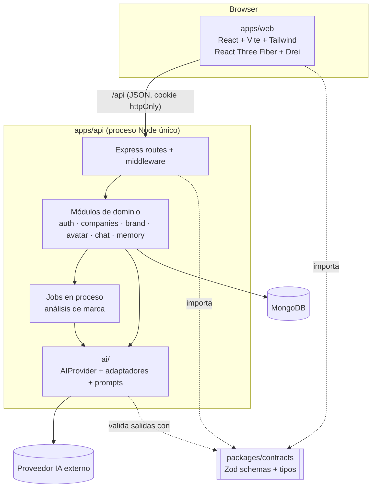

# Arquitectura — Pixel MVP 0.1

Monolito modular en un monorepo con npm workspaces. Un frontend SPA, una API REST y un paquete de
contratos compartido. Sin microservicios, sin colas externas, sin servicios adicionales a MongoDB.

---

## 1. Vista general



## 2. Estructura del monorepo

```
/
├─ package.json              # workspaces + scripts raíz (dev, build, typecheck, lint, test)
├─ tsconfig.base.json        # strict, ESM, NodeNext / Bundler según workspace
├─ eslint.config.js          # flat config + typescript-eslint
├─ .prettierrc
├─ .env.example
├─ apps/
│  ├─ api/
│  │  ├─ src/
│  │  │  ├─ server.ts                 # bootstrap: env, conexión DB, recuperación de jobs, listen
│  │  │  ├─ app.ts                    # createApp(): Express sin efectos (usable en tests)
│  │  │  ├─ config/env.ts             # variables de entorno validadas con Zod
│  │  │  ├─ db/
│  │  │  │  ├─ connection.ts
│  │  │  │  └─ tenantScoped.plugin.ts # exige companyId en queries de modelos de empresa
│  │  │  ├─ middleware/
│  │  │  │  ├─ requireAuth.ts
│  │  │  │  ├─ requireCompanyAccess.ts
│  │  │  │  ├─ validate.ts            # valida body/params/query con schemas de contracts
│  │  │  │  └─ errorHandler.ts        # errores → ApiError de contracts
│  │  │  ├─ modules/
│  │  │  │  ├─ auth/        user.model · auth.service · auth.routes
│  │  │  │  ├─ companies/   company.model · company.service · company.routes · onboarding.routes
│  │  │  │  ├─ brand/       brandDna.model · brandAnalysis.service · brandAnalysis.job · brand.routes
│  │  │  │  ├─ avatar/      avatarProfile.model · avatarDesign.service · avatar.routes
│  │  │  │  ├─ chat/        conversation.model · message.model · contextBuilder · pixelChat.service · chat.routes
│  │  │  │  └─ memory/      creativeMemory.model · memory.service · memory.routes
│  │  │  └─ ai/
│  │  │     ├─ AIProvider.ts           # interfaz
│  │  │     ├─ structured.ts           # generateObject + validación Zod + 1 reintento
│  │  │     ├─ providers/mock.provider.ts
│  │  │     ├─ providers/<real>.provider.ts
│  │  │     ├─ prompts/brandAnalysis.prompt.ts
│  │  │     ├─ prompts/avatarDesign.prompt.ts
│  │  │     ├─ prompts/pixelChat.prompt.ts
│  │  │     └─ index.ts                # createAIProvider(env)
│  │  └─ test/
│  └─ web/
│     └─ src/
│        ├─ main.tsx · App.tsx (router)
│        ├─ lib/api.ts                 # cliente fetch tipado, valida respuestas con contracts
│        ├─ features/
│        │  ├─ auth/        LoginPage · RegisterPage · AuthProvider · RequireAuth
│        │  ├─ companies/   CompaniesPage · CreateCompanyForm
│        │  ├─ onboarding/  OnboardingWizard · steps/*
│        │  ├─ brand/       AnalysisPage · BrandDnaSummary
│        │  ├─ avatar/      PixelAvatar · archetypes/* · faces/* · motion.ts · profileToScene.ts · AvatarRationale
│        │  ├─ chat/        ChatPage · MessageList · Composer
│        │  └─ memory/      MemoryPanel
│        └─ components/ui/  # botones, inputs, layout (Tailwind, sin librería de componentes)
├─ packages/
│  └─ contracts/
│     └─ src/
│        ├─ common.ts       # ObjectId (string), HexColor, timestamps, paginación
│        ├─ errors.ts       # ApiError { code, message, details? }
│        ├─ auth.ts · user.ts · company.ts · onboarding.ts
│        ├─ brandDna.ts · avatarProfile.ts
│        ├─ chat.ts · memory.ts
│        └─ index.ts
└─ docs/
```

### Notas de build

- Todo el monorepo es **ESM** (`"type": "module"`).
- `packages/contracts` se compila con `tsc` a `dist/` (con `.d.ts`). `apps/api` y `apps/web` lo
  consumen como dependencia de workspace (`"@pixel/contracts": "*"`). En `dev`, `tsc --watch` de
  contracts corre en paralelo.
- `apps/api`: `tsx watch` en desarrollo, `tsc` para build.
- `apps/web`: Vite; proxy `/api → http://localhost:<API_PORT>` en desarrollo (mismo origen → cookies simples, sin CORS en dev).
- `contracts` **solo** depende de `zod`. Nunca importa Mongoose, Express ni React.

## 3. Capas del backend

| Capa | Responsabilidad | Regla |
|---|---|---|
| Routes | HTTP: parseo, validación (`validate` + schema de contracts), código de estado | Sin lógica de negocio ni acceso directo a modelos |
| Middleware | `requireAuth` (JWT de cookie → `req.user`), `requireCompanyAccess` (`req.company`) | Toda ruta `/api/companies/:companyId/*` usa ambos |
| Services | Lógica de dominio. Firma con `companyId` explícito: `service.method(companyId, ...)` | No conocen Express. No conocen el SDK de IA |
| Models | Schemas Mongoose + índices + plugin `tenantScoped` | Convierten a DTO de contracts antes de salir (`toDTO`) |
| `ai/` | Proveedores, prompts, salida estructurada | Único lugar donde se importan SDKs de IA (regla ESLint `no-restricted-imports`) |

## 4. Aislamiento multiempresa (tenant isolation)

Defensa en capas — basta con que una falle para que otra lo detenga:

1. **Ruta**: recursos de empresa siempre bajo `/api/companies/:companyId/...`.
2. **Middleware** `requireCompanyAccess`: carga `Company` con `{ _id: companyId, ownerUserId: req.user.id }`.
   Si no existe → `404 COMPANY_NOT_FOUND`. Expone `req.company`.
3. **Servicios**: `companyId` es el primer parámetro; jamás se toma del body.
4. **Consultas**: siempre `{ companyId, ... }`; para un documento concreto, `{ _id, companyId }`.
5. **Plugin `tenantScoped`**: hooks `pre` de `find*`, `count*`, `update*`, `delete*` y `aggregate` lanzan
   error si el filtro no contiene `companyId`. En `save`, `companyId` es requerido por schema.
6. **Contexto de IA**: `ContextBuilder.build(companyId, conversationId)` solo lee de colecciones de esa
   empresa. Los prompts nunca incluyen datos de otra empresa; por construcción, ni una inyección de
   prompt puede exponer información ajena porque no está en el contexto.
7. **Tests**: suite dedicada "isolation" con dos usuarios y dos empresas que prueba cada endpoint
   (lectura y escritura cruzada → 404) y el contenido del contexto de IA.

## 5. Capa de IA

### 5.1 Interfaz

```ts
// apps/api/src/ai/AIProvider.ts
export interface AIChatTurn { role: 'user' | 'assistant'; content: string }

export interface AIUsage { inputTokens?: number; outputTokens?: number }

export interface AIProvider {
  readonly name: string;   // 'mock' | 'anthropic' | ...
  readonly model: string;

  /** Respuesta de texto libre (chat). */
  generateText(input: {
    system: string;
    messages: AIChatTurn[];
    maxTokens?: number;
    temperature?: number;
  }): Promise<{ text: string; usage?: AIUsage }>;

  /** Respuesta JSON cruda; la validación la hace generateObject() en structured.ts. */
  generateJson(input: {
    system: string;
    prompt: string;
    jsonSchema: Record<string, unknown>; // derivado del schema Zod
    maxTokens?: number;
  }): Promise<{ json: unknown; usage?: AIUsage }>;
}
```

```ts
// apps/api/src/ai/structured.ts
generateObject<T>(provider, { system, prompt, schema: ZodType<T>, schemaName }): Promise<T>
// 1. pide JSON al proveedor  2. valida con Zod
// 3. si falla, 1 reintento incluyendo los errores de validación  4. si vuelve a fallar → AIOutputError
```

### 5.2 Servicios de dominio sobre la IA

| Servicio | Entrada | Salida | Notas |
|---|---|---|---|
| `BrandAnalysisService` | `companyId`, `BrandOnboardingInput` | `BrandDNA` (validado) | Prompt versionado (`promptVersion`) guardado en el documento |
| `AvatarDesignService` | `companyId`, `BrandDNA` | `AvatarProfile` (validado) | **Solo recibe el BrandDNA**. Restringido a un catálogo cerrado de arquetipos/estilos que el frontend sabe renderizar. Debe devolver `rationale` |
| `PixelChatService` | `companyId`, `conversationId`, mensaje del usuario | Mensaje de Pixel | System prompt = rol de director creativo + BrandDNA + memorias activas; historial de últimos N mensajes |

### 5.3 Selección de proveedor

- `AI_PROVIDER=mock|<real>` y `AI_MODEL=<id>` en `.env`. `createAIProvider(env)` devuelve la implementación.
- `MockAIProvider`: determinista, sin red. Deriva BrandDNA/AvatarProfile plausibles del input
  (p. ej. palabras clave "café" → `seed`, "tecnología" → `crystal`, "construcción" → `block`) para
  poder recorrer el flujo completo en dev y en tests.
- Las claves de API viven solo en el backend.

## 6. Avatar 3D (renderer paramétrico)

No se generan mallas con IA. El avatar se **compone** en el cliente con primitivas/geometrías
procedurales de Three.js a partir del `AvatarProfile`:

```
AvatarProfile ──profileToScene()──▶ SceneSpec ──▶ <PixelAvatar>
   (datos validados)   (función pura, testeable)    ├─ <Archetype body>   seed | crystal | block | blob | drop | capsule
                                                    ├─ <Face>             ojos, boca, cejas, rubor
                                                    ├─ material            meshStandard/Physical según MaterialStyle
                                                    ├─ motion              idle + estados idle/thinking/talking (useFrame)
                                                    └─ entorno Drei        Environment, ContactShadows, OrbitControls limitados
```

- `profileToScene` es una función pura: se testea sin WebGL.
- Catálogo cerrado (`enum` en contracts): la IA solo puede elegir valores que existen en el renderer.
- El componente 3D se carga con `React.lazy` para no penalizar el bundle inicial.
- Sin WebGL → fallback 2D con la paleta y el nombre del arquetipo.
- Estados del avatar: `idle`, `thinking` (mientras espera respuesta de la IA), `talking`
  (animación simple de boca/escala durante ~N ms según largo del texto; **no** es lip-sync).

## 7. API REST

Prefijo `/api`. JSON. Errores con forma `ApiError { code, message, details? }`.

| Método | Ruta | Descripción |
|---|---|---|
| GET | `/health` | Salud del servicio y de la conexión a DB |
| POST | `/auth/register` | Crea usuario, inicia sesión |
| POST | `/auth/login` | Inicia sesión (cookie httpOnly) |
| POST | `/auth/logout` | Cierra sesión |
| GET | `/auth/me` | Usuario actual |
| GET | `/companies` | Empresas del usuario |
| POST | `/companies` | Crear empresa |
| GET | `/companies/:companyId` | Empresa + estado del análisis |
| PUT | `/companies/:companyId/onboarding` | Guardar borrador del onboarding |
| POST | `/companies/:companyId/onboarding/submit` | Validar y lanzar análisis (`202`) |
| POST | `/companies/:companyId/analysis/retry` | Reintentar/regenerar análisis (`202`) |
| GET | `/companies/:companyId/brand-dna` | BrandDNA activo |
| GET | `/companies/:companyId/avatar-profile` | AvatarProfile activo |
| GET | `/companies/:companyId/conversations` | Conversaciones |
| POST | `/companies/:companyId/conversations` | Nueva conversación |
| GET | `/companies/:companyId/conversations/:conversationId/messages` | Mensajes |
| POST | `/companies/:companyId/conversations/:conversationId/messages` | Enviar mensaje → `{ userMessage, pixelMessage }` |
| GET | `/companies/:companyId/memories` | Memorias activas |
| POST | `/companies/:companyId/memories` | Crear memoria |
| DELETE | `/companies/:companyId/memories/:memoryId` | Desactivar memoria |

## 8. Procesamiento asíncrono del análisis

- `submit` cambia `status → analyzing`, responde `202` y ejecuta el job **en el mismo proceso**
  (promesa no bloqueante con manejo de errores). Sin colas externas.
- El job: BrandDNA → guarda → AvatarProfile → guarda → `status = ready` (o `failed` con `analysis.error`).
- Protección de concurrencia: `submit`/`retry` usan una actualización condicional
  (`status ≠ analyzing`) para no lanzar dos análisis a la vez.
- Recuperación: al arrancar, empresas en `analyzing` con `analysis.startedAt` más antiguo que
  `ANALYSIS_TIMEOUT_MS` → `failed`.
- El frontend hace polling a `GET /companies/:companyId` cada 2 s mientras `status = analyzing`.

## 9. Seguridad

- Contraseñas con `bcryptjs` (sin dependencias nativas). Email normalizado a minúsculas.
- JWT firmado (`JWT_SECRET`), cookie `httpOnly`, `SameSite=Lax`, `Secure` en producción.
- La API solo acepta `application/json` en mutaciones (mitiga CSRF junto con `SameSite`).
- Validación Zod de todo input; límites de tamaño de body y de longitud de campos del onboarding y mensajes.
- `helmet` no es imprescindible en 0.1; rate limiting de login queda en backlog (riesgo aceptado para el MVP).
- Nunca se loguean contraseñas, tokens ni prompts completos con datos de la empresa en producción.

## 10. Configuración (`.env.example`)

```
# api
PORT=4000
MONGODB_URI=mongodb://localhost:27017/pixel
JWT_SECRET=change-me
AI_PROVIDER=mock
AI_MODEL=
AI_API_KEY=
ANALYSIS_TIMEOUT_MS=180000
CHAT_HISTORY_LIMIT=20
```

## 11. Testing

| Nivel | Herramienta | Qué cubre |
|---|---|---|
| Contratos | Vitest | Schemas válidos/inválidos, fixtures de los 3 escenarios de demo |
| API unit | Vitest | Servicios con `MockAIProvider`, `structured.ts` (reintento), `ContextBuilder` |
| API integración | Vitest + Supertest + mongodb-memory-server | Endpoints, auth, **aislamiento entre empresas** |
| Web | Vitest | `profileToScene`, cliente API, validación de formularios |
| E2E | Manual guiado (checklist) en 0.1 | Recorrido completo con `AI_PROVIDER=mock` |

## 12. Riesgos y mitigaciones

| Riesgo | Impacto | Mitigación |
|---|---|---|
| Fuga de datos entre empresas | Crítico | Defensa en capas (§4) + suite de tests de aislamiento |
| La IA devuelve JSON inválido o incompleto | Alto | Zod + 1 reintento con errores + estado `failed` y reintento manual |
| Avatar percibido como "mascota genérica" | Alto (hipótesis central) | Catálogo diseñado por arquetipo de marca, `rationale` obligatoria que cita el ADN, revisión con los 3 escenarios |
| Latencia/costo del LLM en el análisis | Medio | Asíncrono + polling, prompts acotados, `maxTokens` |
| Pérdida de jobs al reiniciar el servidor | Medio | Recuperación al arranque → `failed` + reintento |
| Fricción ESM/CJS con el paquete compartido | Medio | ESM en todo, contracts compilado a `dist/` con tipos |
| MongoDB no disponible en algunos entornos (incl. CI) | Medio | `MONGODB_URI` configurable; mongodb-memory-server para tests (requiere descargar binario) |
| Bundle pesado por three.js | Bajo | `React.lazy` del avatar y code splitting por ruta |
| Rate limiting/abuso en auth | Bajo en MVP | Aceptado; en backlog post-MVP |

## 13. Registro de decisiones (ADR-lite)

| # | Decisión | Motivo |
|---|---|---|
| 1 | Monolito modular, un proceso API | Velocidad para validar el concepto; "no sobrearquitectar" |
| 2 | npm workspaces | Sin herramientas adicionales |
| 3 | Contratos Zod compartidos | Una sola fuente de verdad para API e IA |
| 4 | AvatarProfile derivado del BrandDNA, no del onboarding | Garantiza que el avatar es consecuencia del ADN |
| 5 | Avatar paramétrico con catálogo cerrado | Determinista, renderizable, sin generación 3D avanzada |
| 6 | Jobs en proceso + polling | Evita colas/infra extra en 0.1 |
| 7 | Respuestas de chat sin streaming | Menos complejidad; streaming (SSE) en backlog |
| 8 | Sin librería de estado/servidor en web (fetch + hooks + context) | Evitar dependencias no necesarias; reevaluar si crece |
