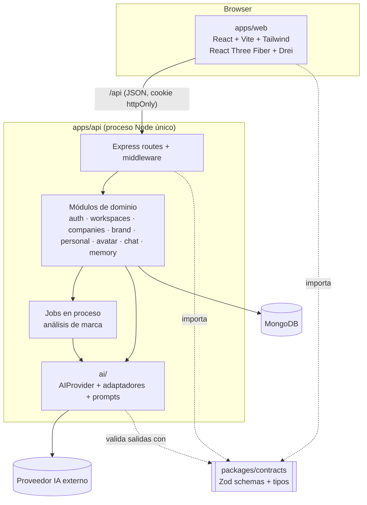

# Arquitectura — Pixel MVP 0.1

Monolito modular en un monorepo con npm workspaces. Un frontend SPA, una API REST y un paquete de
contratos compartido. Sin microservicios, sin colas externas, sin servicios adicionales a MongoDB.

---

## 1. Vista general



## 2. Estructura del monorepo

```
/
├─ package.json              # workspaces + scripts raíz (dev, build, typecheck, lint, test)
├─ tsconfig.base.json        # strict, ESM, NodeNext / Bundler según workspace
├─ eslint.config.js          # flat config + typescript-eslint
├─ .prettierrc
├─ .nvmrc
├─ apps/
│  ├─ api/
│  │  ├─ .env.example
│  │  ├─ src/
│  │  │  ├─ server.ts                 # bootstrap: env, conexión DB (con reintentos), listen, apagado limpio
│  │  │  ├─ app.ts                    # createApp(): Express sin efectos (usable en tests)
│  │  │  ├─ config/env.ts             # variables de entorno validadas con Zod
│  │  │  ├─ lib/
│  │  │  │  ├─ logger.ts              # logger mínimo: pretty en dev, JSON por línea en producción
│  │  │  │  └─ errors.ts              # AppError + helpers (notFound, badRequest, ...)
│  │  │  ├─ db/
│  │  │  │  ├─ connection.ts          # startDatabase / stopDatabase / getDatabaseStatus
│  │  │  │  └─ tenantScoped.plugin.ts # exige workspaceId (o companyId en BrandDNA) concreto en cada consulta
│  │  │  ├─ middleware/
│  │  │  │  ├─ requestLogger.ts       # requestId (X-Request-Id) + log por petición
│  │  │  │  ├─ notFound.ts
│  │  │  │  ├─ errorHandler.ts        # errores → ApiError de contracts
│  │  │  │  ├─ requireAuth.ts         # (Etapa 3)
│  │  │  │  ├─ requireCompanyAccess.ts# (Etapa 4)
│  │  │  │  └─ validate.ts            # (Etapa 3) valida body/params/query con schemas de contracts
│  │  │  ├─ modules/
│  │  │  │  ├─ index.ts           # registro único de módulos y sus rutas
│  │  │  │  ├─ health/            GET /api/health
│  │  │  │  ├─ auth/              user.model · auth.service · auth.routes
│  │  │  │  ├─ companies/         company.model · company.service · companies.routes (+ onboarding)
│  │  │  │  ├─ brand-dna/         brandDna.model · brandDna.service · brandDna.generator · brandDna.lexicon · brand-dna.routes
│  │  │  │  ├─ avatars/           avatarProfile.model · avatar.service · avatars.routes · engine/ (interfaz, catálogo, reglas)
│  │  │  │  ├─ conversations/     conversation.model · message.model · contextBuilder · pixelChat.service · conversations.routes
│  │  │  │  ├─ creative-memory/   creativeMemory.model · creativeMemory.service · creative-memory.routes
│  │  │  │  ├─ operations/        project/task/contentItem.model · projects/tasks/content/summary.service · operations.scope · operations.routes (docs/OPERATIONS.md)
│  │  │  │  ├─ content-plans/     contentPlan/contentPlanItem.model · contentPlanning.engine · contentPlanning.grounding · contentPlans.service · contentPlans.routes (docs/CONTENT-PLANNER.md)
│  │  │  │  └─ daily-director/    dailyBrief.model · dailyData.collector · priorityScorer · projectHealth · contentHealth · dailyAnalysis · dailyDirector.engine · dailyFallback · dailyBrief.service · dailyBrief.routes (docs/DAILY-DIRECTOR.md)
│  │  │  └─ ai/
│  │  │     ├─ AIProvider.ts           # interfaz
│  │  │     ├─ structured.ts           # generateObject + validación Zod + 1 reintento
│  │  │     ├─ providers/mock.provider.ts
│  │  │     ├─ providers/<real>.provider.ts
│  │  │     ├─ prompts/brandAnalysis.prompt.ts
│  │  │     ├─ prompts/avatarDesign.prompt.ts
│  │  │     ├─ prompts/pixelChat.prompt.ts
│  │  │     └─ index.ts                # createAIProvider(env)
│  │  └─ test/
│  └─ web/
│     ├─ .env.example · vite.config.ts (proxy /api)
│     └─ src/
│        ├─ main.tsx · index.css (tokens de tema Tailwind)
│        ├─ app/                       # router, AppShell, Sidebar, Header, navigation
│        ├─ components/                # Icon, PixelMark, PageHeader, EmptyState (sin librería de UI)
│        ├─ lib/api.ts                 # cliente fetch tipado, valida respuestas con contracts
│        └─ features/
│           ├─ auth/        LoginPage (+ RegisterPage, AuthProvider en Etapa 3)
│           ├─ dashboard/   DashboardPage
│           ├─ companies/   CompaniesPage · CompanyOverviewPage (+ onboarding en Etapa 4)
│           ├─ brand/       BrandPage (+ AnalysisPage, BrandDnaSummary)
│           ├─ pixel/       PixelPage (+ PixelAvatar, archetypes, profileToScene, AvatarRationale)
│           ├─ chat/        ChatPage (+ MessageList, Composer, MemoryPanel)
│           └─ system/      ApiStatus · useApiHealth · NotFoundPage
├─ packages/
│  └─ contracts/
│     └─ src/
│        ├─ common.ts       # ObjectId (string), HexColor, timestamps, paginación
│        ├─ errors.ts       # ApiError { code, message, details? }
│        ├─ auth.ts · user.ts · company.ts · onboarding.ts
│        ├─ brandDna.ts · avatarProfile.ts
│        ├─ chat.ts · memory.ts
│        └─ index.ts
└─ docs/
```

### Notas de build

- Todo el monorepo es **ESM** (`"type": "module"`).
- `packages/contracts` se compila con `tsc` a `dist/` (con `.d.ts`). `apps/api` y `apps/web` lo
  consumen como dependencia de workspace (`"@pixel/contracts": "*"`). En `dev`, `tsc --watch` de
  contracts corre en paralelo.
- `apps/api`: `tsx watch` en desarrollo, `tsc` para build.
- `apps/web`: Vite; proxy `/api → http://localhost:<API_PORT>` en desarrollo (mismo origen → cookies simples, sin CORS en dev).
- `contracts` **solo** depende de `zod`. Nunca importa Mongoose, Express ni React.

## 3. Capas del backend

| Capa | Responsabilidad | Regla |
|---|---|---|
| Routes | HTTP: parseo, validación (`validate` + schema de contracts), código de estado | Sin lógica de negocio ni acceso directo a modelos |
| Middleware | `requireAuth` (JWT de cookie → `req.auth`), `requireWorkspaceAccess` (`req.workspace`), `requireCompanyAccess` (`req.company` + `req.workspace`), `requireEnterpriseCompany` | Toda ruta `/api/workspaces/:workspaceId/*` usa `requireAuth` + `requireWorkspaceAccess`; las legacy `/api/companies/:companyId/*`, `requireAuth` + `requireCompanyAccess` |
| Services | Lógica de dominio. Reciben el workspace (y en Enterprise la empresa) ya autorizados | No conocen Express. No conocen el SDK de IA |
| Models | Schemas Mongoose + índices + plugin `tenantScoped` | Convierten a DTO de contracts antes de salir (`toDTO`) |
| `ai/` | Proveedores, prompts, salida estructurada | Único lugar donde se importan SDKs de IA (regla ESLint `no-restricted-imports`) |

## 4. Aislamiento por Workspace (tenant isolation)

**Workspace is the main contextual boundary of Pixel.** Detalle completo en
[`WORKSPACES.md`](./WORKSPACES.md). Defensa en capas — basta con que una falle para que otra lo detenga:

1. **Rutas**: recursos de un Pixel bajo `/api/workspaces/:workspaceId/...`; Enterprise mantiene las
   rutas legacy `/api/companies/:companyId/...`.
2. **Middleware**: `requireWorkspaceAccess` carga el workspace con `{ _id, ownerId: req.auth.userId }`
   (404 si no); `requireCompanyAccess` carga la empresa con `{ _id, ownerId }`, garantiza su workspace
   (migración perezosa) y expone `req.company` y `req.workspace`.
3. **Servicios**: reciben el workspace autorizado; jamás toman el tenant del body. En Enterprise,
   `assertEnterpriseScope` comprueba que la empresa pertenece al workspace y al mismo dueño.
4. **Consultas**: siempre con la clave de aislamiento: `{ workspaceId, ... }` en recursos del
   workspace, `{ companyId, ... }` en BrandDNA; para un documento concreto, `{ _id, workspaceId }`.
5. **Plugin `tenantScoped(schema, { key })`**: hooks `pre` de `find*`, `count*`,
   `estimatedDocumentCount`, `update*`, `delete*`, `aggregate` y `bulkWrite` lanzan error si el filtro
   no trae un valor concreto de la clave (se rechazan `$exists`, `$ne`, `$in`…). En altas, la clave es
   requerida por schema.
6. **Contexto de IA**: `resolveContextBuilder(workspace.type).build({ workspace, … })` solo lee datos de
   ese workspace. Los prompts nunca incluyen datos de otro workspace; por construcción, ni una
   inyección de prompt puede exponer información ajena porque no está en el contexto. El estado
   operativo Enterprise (conteos de Operations) se calcula con el mismo `workspaceId`.
7. **Capacidades**: `assertWorkspaceFeature` (contracts `capabilities.ts`) bloquea con 400
   `feature_not_available` lo que un tipo de workspace no tiene (Content Planner y Daily Director
   en Enterprise).
8. **Tests**: aislamiento entre usuarios y entre workspaces del mismo dueño en cada endpoint
   (lectura y escritura cruzada → 404, sin rastro en la base) y en el contenido del contexto de IA.

## 5. Capa de IA ✅

```
apps/api/src/ai/
├─ AIProvider.ts            interfaz: generateText() y generateStructuredOutput()
├─ errors.ts                AIProviderError { kind: unavailable | rate_limited | refused | invalid_output | misconfigured }
├─ brief.ts                 CreativeBrief (contexto de marca estructurado, <brand_context> en el prompt)
├─ providers/
│  ├─ anthropic.provider.ts SDK oficial @anthropic-ai/sdk
│  └─ demo.provider.ts      respuestas locales sin IA (desarrollo sin clave y tests)
└─ index.ts                 createAIProvider(env)
```

- **Nada fuera de `src/ai/` importa SDKs de IA** (regla ESLint `no-restricted-imports`). Las rutas y
  servicios reciben un `AIProvider` inyectado (`createApp({ ai })`), así que los tests usan
  proveedores falsos o el demo.
- **Anthropic**: modelo `AI_MODEL` (por defecto `claude-opus-5-5`), esfuerzo `medium` explícito, sin
  `temperature` (el modelo no la acepta), system prompt con `cache_control` (estable por empresa y
  versión de ADN), `fallbacks: "default"` (beta `server-side-fallback-2026-07-01`: si el modelo
  declina, el servidor reintenta con el modelo recomendado), revisión de `stop_reason: "refusal"`,
  errores tipados del SDK → `AIProviderError`. Salida estructurada con `beta.messages.parse` +
  `betaZodOutputFormat`, revalidada con Zod.
- **Selección**: `AI_PROVIDER=anthropic|demo`; si se omite, `anthropic` cuando hay `ANTHROPIC_API_KEY`
  y `demo` si no. El modo demo se avisa en el log y en la interfaz.
- **PersonalDNA**: `PersonalDnaGenerator` usa `generateStructuredOutput()` (schema Zod
  `PersonalDnaEnrichmentSchema`) solo para enriquecer resumen, fortalezas y arquetipos cuando hay un
  proveedor real, y descarta lo que no se apoya en las respuestas ([`PERSONAL.md` §4](./PERSONAL.md#4-generación-del-personaldna)).
- **Pendiente**: generar BrandDNA y AvatarProfile con IA usando `generateStructuredOutput()`
  (hoy son determinísticos).

### 5.1 PixelContextBuilder (por estrategia)

`apps/api/src/modules/conversations/context/`: `resolveContextBuilder(workspace.type)` elige
`EnterpriseContextBuilder` (carga Company → BrandDNA → AvatarProfile → CreativeMemory del workspace) o
`PersonalContextBuilder` (carga PersonalProfile → PersonalDNA → AvatarProfile → CreativeMemory del
workspace personal; compone con `buildPersonalPixelContext` el prompt del Director Creativo Personal,
en segunda persona, con su brief en `<personal_context>`). Devuelven `ready` con el contexto, o
`not_configured` con un motivo (→ 409: `brand_dna_missing`, `enterprise_company_missing`,
`personal_context_not_configured`). El AIProvider recibe el contexto ya preparado y nunca ve
`companyId` ni ids de perfiles. Detalle Personal en [`PERSONAL.md` §7](./PERSONAL.md#7-personalcontextbuilder).

La composición Enterprise es la función pura `pixelContext.builder.ts` (`buildPixelContext`), que
construye el contexto del Pixel de **una** marca a partir de datos ya cargados del mismo workspace.

- **Rol**: director creativo propio de la empresa, que habla en primera persona del plural.
- **Criterio, no recitación**: instrucciones explícitas para usar el ADN como criterio (nunca
  describir la marca ni enumerar rasgos), aterrizar en piezas y copy, no inventar datos, una sola
  pregunta al final si hace falta, ~220 palabras.
- **Palancas creativas** derivadas del ADN: origen, diferenciadores como prueba, tensión del
  público (problema → necesidad), postura del arquetipo y recursos visuales. Se ordenan según el
  tema detectado en la petición (`detectFocus`: social, campaign, launch, naming, visual, avatar,
  audience).
- **Conocimiento de marca** compacto en `<brand_context>` (identidad, propósito, público,
  personalidad, tono, estilo visual, diferenciadores, preferencias y restricciones).
- **AvatarProfile** solo cuando la petición es visual o sobre el personaje.
- **Límites**: historial de la conversación ≤ `CHAT_HISTORY_LIMIT` mensajes y ≤ 12 000 caracteres
  (se descartan los más antiguos; siempre empieza por un turno de usuario); listas del brief ≤ 5
  elementos de ≤ 180 caracteres; mensaje del usuario ≤ 4 000 caracteres (validado con Zod).

### 5.2 Flujo de un mensaje

`POST /workspaces/:workspaceId/conversations/:conversationId/messages` (o la ruta legacy
`/companies/:companyId/...`): requireAuth → requireWorkspaceAccess / requireCompanyAccess →
conversación `{ _id, workspaceId, userId }` → historial → estrategia de contexto por tipo de
workspace (Enterprise: BrandDNA vigente, 409 si no hay; AvatarProfile y memorias opcionales) →
`ai.generateText()` → se guardan **juntos** el mensaje del usuario y el de Pixel (si la IA falla no
se guarda nada: 503, o 422 si el modelo declina) → respuesta. El frontend pone el avatar en
`thinking` durante la petición, en `speaking` mientras revela la respuesta y vuelve a `idle`.

## 6. Avatar 3D (renderer paramétrico) ✅

No se generan mallas con IA. El avatar se **compone** en el cliente con primitivas y geometrías
procedurales de Three.js (React Three Fiber + Drei) a partir del `AvatarProfile`. Tres capas
separadas (`apps/web/src/features/avatar3d/`):

```
BrandDNA ──(API: Avatar Concept Engine, reglas de negocio)──▶ AvatarProfile
AvatarProfile ──profileToScene() (traducción visual pura)──▶ SceneSpec
estado + tiempo ──poseAt() (función pura)──▶ Pose objetivo

<PixelAvatar profile state>                Canvas, cámara responsiva, controles limitados
 ├─ <AvatarEnvironment>                    luces, sombras, environment procedural (Lightformers)
 └─ <PresentationControls snap>            giro acotado que vuelve solo al frente; sin zoom ni pan
     └─ <AvatarController>                 interpola la pose (damp) y la aplica cada frame
         ├─ <AvatarBody>                   seed | crystal | block | blob | drop | capsule (+ ranura, líneas)
         ├─ <AvatarFace>                   <AvatarEyes> <AvatarMouth> + rubor
         ├─ <AvatarLimbs>                  brazos y piernas (mano con accesorio)
         ├─ <AvatarAccessory>              hoja, taza, anillo orbital, casco, insignia
         └─ <ThinkingDots>
```

- **Sin reglas de negocio en Three.js**: los componentes solo leen `SceneSpec` y la pose.
  `profileToScene` y `poseAt` se testean sin WebGL.
- **Estados**: `idle` (movimiento sutil según `idleBehavior` + parpadeo y mirada),
  `thinking` (mira arriba, mano a la barbilla, puntos), `listening` (se inclina, asiente),
  `speaking` (boca con aperturas tipo sílaba y pausas, gestos de cabeza y brazos; **no** es
  lip-sync), `happy` (salta, brazos arriba, ojos en arco). Las transiciones se interpolan.
  La expresividad y la energía del perfil escalan amplitud y velocidad.
- En `/pixel`: "Pensando" mientras se genera el concepto y "Feliz" al recibirlo. En desarrollo
  aparece un controlador manual de estados (`import.meta.env.DEV`).
- **Cámara**: encuadra al personaje completo calculando la distancia por alto y por ancho del
  lienzo (escritorio y móvil). `PresentationControls` en vez de OrbitControls: rotación acotada
  (±43° horizontal, poca vertical) con retorno automático al frente.
- **Rendimiento**: `dpr` máx. 1,75, sombras PCF de 1024 px + ContactShadows, sin HDRI externos.
  El renderer se carga con `React.lazy` (paquete aparte, ~280 kB gzip, solo en `/pixel`).
- **Fallback**: sin WebGL o si la escena falla (ErrorBoundary) se muestra la vista SVG provisional.

## 7. API REST

Prefijo `/api`. JSON. Errores con forma `ApiError { code, message, details? }`.

| Método | Ruta | Descripción |
|---|---|---|
| GET | `/health` | Salud del servicio y de la conexión a DB |
| POST | `/auth/register` | Crea usuario, inicia sesión |
| POST | `/auth/login` | Inicia sesión (cookie httpOnly) |
| POST | `/auth/logout` | Cierra sesión |
| GET | `/auth/me` | Usuario actual |
| GET | `/workspaces` | "Tus Pixels": workspaces del usuario con su empresa o su resumen personal ✅ |
| POST | `/workspaces` | Crear workspace `{ type: enterprise \| personal, name }` (Personal: uno por usuario) ✅ |
| GET | `/workspaces/:workspaceId` | Workspace + su empresa (enterprise) o `personal` (resumen) ✅ |
| PATCH | `/workspaces/:workspaceId` | `name`, `status` (el tipo no se edita) ✅ |
| POST | `/workspaces/:workspaceId/company` | Completa un workspace enterprise vacío con su empresa (Personal → 400) ✅ |
| GET/POST | `/workspaces/:workspaceId/avatar[/generate]` | Avatar del workspace: BrandDNA (Enterprise) o PersonalDNA (Personal); sin ADN → 409 ✅ |
| GET/POST | `/workspaces/:workspaceId/conversations[/:id/messages]` | Conversaciones del workspace; sin ADN → 409 con `details.reason` ✅ |
| GET/PUT | `/workspaces/:workspaceId/personal-profile` | Pixel Personal: perfil y onboarding por pasos (Enterprise → 400) ✅ |
| GET/PUT | `/workspaces/:workspaceId/personal-dna` | Pixel Personal: ADN vigente y correcciones manuales ✅ |
| POST | `/workspaces/:workspaceId/personal-dna/generate` | Pixel Personal: (re)genera el ADN desde el onboarding ✅ |
| CRUD | `/workspaces/:workspaceId/projects[/:projectId]` | Operations: proyectos (cualquier tipo de workspace; DELETE archiva) ✅ |
| CRUD | `/workspaces/:workspaceId/tasks[/:taskId]` | Operations: tareas (filtros `status`, `priority`, `projectId`, `due`, `search`) ✅ |
| CRUD | `/workspaces/:workspaceId/content[/:contentItemId]` | Operations: piezas de contenido (filtros `status`, `platform`, `format`, `projectId`, `search`) ✅ |
| GET | `/workspaces/:workspaceId/operations/summary` | Operations: conteos y próximos elementos del Inicio ✅ |
| POST | `/workspaces/:workspaceId/content-plans/generate` | Content Planner: Pixel propone estrategia + propuestas (solo Personal; sin ADN → 409) ✅ |
| CRUD | `/workspaces/:workspaceId/content-plans[/:planId]` | Planes de contenido (DELETE archiva) ✅ |
| PATCH/POST | `/workspaces/:workspaceId/content-plans/:planId/items/:itemId[/accept · /reject]` | Editar, aceptar (→ ContentItem, idempotente) o rechazar una propuesta ✅ |
| GET | `/workspaces/:workspaceId/daily-brief` | Daily Director: dirección vigente de hoy + `stale` (404 `daily_brief_not_generated`) ✅ |
| POST | `/workspaces/:workspaceId/daily-brief/generate` | Genera o regenera la dirección del día (IA o determinística) ✅ |
| GET | `/workspaces/:workspaceId/daily-briefs[/:briefId]` | Historial de direcciones ✅ |
| GET | `/companies` | Empresas del usuario (legacy) |
| POST | `/companies` | Crear empresa: crea también su workspace enterprise |
| GET | `/companies/:companyId` | Empresa + estado del análisis |
| PATCH | `/companies/:companyId` | Actualizar `name`, `industry`, `description`, `logoUrl` (slug y estado no editables) |
| GET | `/companies/:companyId/brand-dna` | Progreso del onboarding (respuestas, pasos completos) + BrandDNA vigente ✅ |
| PUT | `/companies/:companyId/brand-dna` | Guarda un paso `{ step, data }`; con los 8 pasos completos (re)genera el BrandDNA ✅ |
| POST | `/companies/:companyId/onboarding/submit` | (Etapa 6, con IA) Lanzar análisis asíncrono (`202`) |
| POST | `/companies/:companyId/analysis/retry` | Reintentar/regenerar análisis (`202`) |
| GET | `/companies/:companyId/avatar` | Avatar vigente, historial (máx. 20) e `isStale` ✅ |
| POST | `/companies/:companyId/avatar/generate` | Crea/regenera el concepto (nueva versión, `201`); `409` sin BrandDNA ✅ |
| GET | `/companies/:companyId/conversations` | Conversaciones del usuario en la empresa ✅ |
| POST | `/companies/:companyId/conversations` | Nueva conversación ✅ |
| GET | `/companies/:companyId/conversations/:conversationId/messages` | Mensajes (últimos 200) ✅ |
| POST | `/companies/:companyId/conversations/:conversationId/messages` | Enviar mensaje → `{ conversation, userMessage, pixelMessage }` ✅ |
| GET | `/companies/:companyId/memories` | Memorias activas |
| POST | `/companies/:companyId/memories` | Crear memoria |
| DELETE | `/companies/:companyId/memories/:memoryId` | Desactivar memoria |

## 8. Procesamiento asíncrono del análisis

- `submit` cambia `status → analyzing`, responde `202` y ejecuta el job **en el mismo proceso**
  (promesa no bloqueante con manejo de errores). Sin colas externas.
- El job: BrandDNA → guarda → AvatarProfile → guarda → `status = ready` (o `failed` con `analysis.error`).
- Protección de concurrencia: `submit`/`retry` usan una actualización condicional
  (`status ≠ analyzing`) para no lanzar dos análisis a la vez.
- Recuperación: al arrancar, empresas en `analyzing` con `analysis.startedAt` más antiguo que
  `ANALYSIS_TIMEOUT_MS` → `failed`.
- El frontend hace polling a `GET /companies/:companyId` cada 2 s mientras `status = analyzing`.

## 9. Seguridad

- Contraseñas con `bcryptjs` (bcrypt en JS puro, sin compilación nativa; coste `BCRYPT_ROUNDS`, 12 por defecto). Email normalizado a minúsculas.
- Sesión: JWT HS256 (`sub` = userId, expira en `SESSION_TTL_DAYS`) en la cookie `pixel_session`
  `httpOnly`, `SameSite=Lax`, `Secure` en producción. El token nunca va en el cuerpo ni en localStorage.
  `POST /auth/logout` borra la cookie.
- Login: mismo mensaje y tiempo de respuesta similar (hash ficticio) si el email no existe o la contraseña falla.
- `originGuard`: las mutaciones con un `Origin` fuera de `CORS_ORIGINS` → 403 (defensa CSRF junto con `SameSite`).
- `requireAuth` → `req.auth.userId`; `requireWorkspaceAccess` → `req.workspace` (consulta
  `{ _id, ownerId }`); `requireCompanyAccess` → `req.company` + `req.workspace`. Id malformado,
  inexistente o ajeno → el mismo 404.
- `JWT_SECRET` es obligatorio en producción; en desarrollo se usa uno de desarrollo con aviso en el log.
- Validación Zod de todo input; límites de tamaño de body y de longitud de campos del onboarding y mensajes.
- `helmet` no es imprescindible en 0.1; rate limiting de login queda en backlog (riesgo aceptado para el MVP).
- Nunca se loguean contraseñas, tokens ni prompts completos con datos de la empresa en producción.

## 10. Configuración

Cada app tiene su `.env` (ignorado por git) y su `.env.example` versionado.

`apps/api/.env`:

```
NODE_ENV=development
PORT=4000
MONGODB_URI=mongodb://127.0.0.1:27017/pixel
CORS_ORIGINS=http://localhost:5173
LOG_LEVEL=info
JWT_SECRET=            # ≥ 32 caracteres; obligatorio en producción
SESSION_TTL_DAYS=7
BCRYPT_ROUNDS=12
# Se añaden en etapas posteriores: (chat ✅: AI_PROVIDER, AI_MODEL, ANTHROPIC_API_KEY, AI_TIMEOUT_MS, CHAT_HISTORY_LIMIT),
# ANALYSIS_TIMEOUT_MS (6), CHAT_HISTORY_LIMIT (8)
```

`apps/web/.env`:

```
VITE_API_URL=                               # vacío = mismo origen (/api) vía proxy de Vite
VITE_API_PROXY_TARGET=http://localhost:4000
```

### Health check

`GET /api/health` → `200` con `status: "ok"` si MongoDB está conectado; `503` con
`status: "degraded"` si no. La API arranca aunque MongoDB no esté disponible y reintenta la conexión
cada 5 s.

```json
{ "status": "ok", "service": "pixel-api", "version": "0.1.0", "uptimeSeconds": 12, "database": "connected", "timestamp": "..." }
```

## 11. Testing

| Nivel | Herramienta | Qué cubre |
|---|---|---|
| Contratos | Vitest | Schemas válidos/inválidos, fixtures de los 3 escenarios de demo |
| API unit | Vitest | Servicios con `MockAIProvider`, `structured.ts` (reintento), `ContextBuilder` |
| API integración | Vitest + Supertest + mongodb-memory-server | Endpoints, auth, **aislamiento entre usuarios y entre workspaces**, migración Company → Workspace |

Los tests de integración de la API arrancan un MongoDB efímero una vez por ejecución
(`apps/api/test/support/globalSetup.ts`), con una base de datos distinta por archivo. La primera vez
`mongodb-memory-server` descarga el binario de MongoDB (~100 MB). Alternativas: `MONGODB_URI_TEST`
(un MongoDB existente) o `MONGOMS_SYSTEM_BINARY` (un `mongod` ya instalado).
| Web | Vitest (entorno `node`) | `profileToScene`, clientes API (con `fetch` simulado), formularios, navegación y vistas renderizadas con `react-dom/server` (sin jsdom ni Testing Library) |
| E2E | Manual guiado (checklist) en 0.1 | Recorrido completo con `AI_PROVIDER=mock` |

## 12. Riesgos y mitigaciones

| Riesgo | Impacto | Mitigación |
|---|---|---|
| Fuga de datos entre workspaces | Crítico | Defensa en capas (§4) + suite de tests de aislamiento |
| La IA devuelve JSON inválido o incompleto | Alto | Zod + 1 reintento con errores + estado `failed` y reintento manual |
| Avatar percibido como "mascota genérica" | Alto (hipótesis central) | Catálogo diseñado por arquetipo de marca, `rationale` obligatoria que cita el ADN, revisión con los 3 escenarios |
| Latencia/costo del LLM en el análisis | Medio | Asíncrono + polling, prompts acotados, `maxTokens` |
| Pérdida de jobs al reiniciar el servidor | Medio | Recuperación al arranque → `failed` + reintento |
| Fricción ESM/CJS con el paquete compartido | Medio | ESM en todo, contracts compilado a `dist/` con tipos |
| MongoDB no disponible en algunos entornos (incl. CI) | Medio | `MONGODB_URI` configurable; mongodb-memory-server para tests (requiere descargar binario) |
| Bundle pesado por three.js | Bajo | `React.lazy` del avatar y code splitting por ruta |
| Rate limiting/abuso en auth | Bajo en MVP | Aceptado; en backlog post-MVP |

## 13. Registro de decisiones (ADR-lite)

| # | Decisión | Motivo |
|---|---|---|
| 1 | Monolito modular, un proceso API | Velocidad para validar el concepto; "no sobrearquitectar" |
| 2 | npm workspaces | Sin herramientas adicionales |
| 3 | Contratos Zod compartidos | Una sola fuente de verdad para API e IA |
| 4 | AvatarProfile derivado del BrandDNA, no del onboarding | Garantiza que el avatar es consecuencia del ADN |
| 5 | Avatar paramétrico con catálogo cerrado | Determinista, renderizable, sin generación 3D avanzada |
| 6 | Jobs en proceso + polling | Evita colas/infra extra en 0.1 |
| 7 | Respuestas de chat sin streaming | Menos complejidad; streaming (SSE) en backlog |
| 8 | Sin librería de estado/servidor en web (fetch + hooks + context) | Evitar dependencias no necesarias; reevaluar si crece |
| 9 | Operations (Projects, Tasks, ContentItems) como recursos del workspace, API para ambos tipos (Opción A) y UI solo Personal | Reutilizable en Enterprise sin duplicar modelos; `workspaceId` es la única frontera |
| 10 | `DELETE` de un proyecto = archivar; tareas y contenido se borran de verdad | Un proyecto tiene hijos (sin cascadas ni huérfanos); los recursos hoja se conservan con `cancelled`/`archived` si se quiere |
| 11 | `Project.progress` calculado en cada respuesta (2 agregaciones por página) | Nunca inconsistente ni manipulable por el cliente |
| 12 | Filtros "hoy/vencidas/próximas" con `tzOffset` del navegador por petición | Día local correcto sin guardar preferencias de zona horaria |
| 13 | ContentPlanItem separado de ContentItem; conversión explícita e idempotente (reserva atómica) | Planificar ≠ producir; nunca duplicados |
| 14 | Validación de fundamento posterior a la IA (cifras, nombres propios, afirmaciones sobre la audiencia) que descarta propuestas | Pixel no inventa datos personales; se cuenta lo descartado |
| 15 | Plan demo con reglas solo en `AI_PROVIDER=demo`; con un proveedor real caído → 503 sin plan | Desarrollo y tests sin clave, sin calendarios falsos con un modelo real |
| 16 | Daily Director: PriorityScorer determinístico + IA que interpreta refs controladas (TASK_1…); avisos 100 % del backend | El backend controla los hechos; la IA no puede inventar ids, tareas ni urgencias |
| 17 | Daily Director con fallback determinístico (a diferencia del Content Planner) | Un orden útil del día no requiere creatividad; nunca dejar el Inicio vacío |
| 18 | `Workspace.timezone` IANA explícito + `DEFAULT_TIMEZONE` | "Hoy" correcto sin inferir de texto libre ni usar UTC |
| 19 | DailyBrief persistido y versionado por día; GET nunca regenera, solo marca `stale` | Coste de IA controlado e historial para memoria futura |
| 20 | Shared Workspace Operations: Enterprise reutiliza Project, Task y ContentItem (mismos endpoints, servicios y pantallas), sin `companyId` | Una sola frontera de tenant (`workspaceId`); sin modelos `Enterprise*` duplicados |
| 21 | Capacidades por tipo derivadas en contracts (`workspaceSupportsFeature`), nunca persistidas | Un solo punto de feature gating para API y web; sin `if (type === …)` dispersos |
| 22 | Funcionalidades nuevas workspace-first; Enterprise deja en `/workspace/:id` solo las rutas que admite y redirige el resto a `/company/:id` | Converger por pantallas sin reescribir Enterprise de golpe |
| 23 | Chat Enterprise con estado operativo de solo conteos (sin nombres ni listas) | Respuestas conscientes del trabajo sin inflar el prompt ni invitar a inventar proyectos o campañas |
| 24 | Campaign estratégica separada de Project; CampaignStrategy versionada aparte; CampaignDeliverable ≠ ContentItem; `campaignId` opcional solo en Project y ContentItem (no en Task) | Estrategia y ejecución no se mezclan; historial sin sobrescribir; Operations no se duplican |
| 25 | CampaignStrategyEngine con contexto controlado + validación de fundamento propia de marca (claims de mercado, cifras, nombres, restricciones visuales, paleta, canales del brief) | Pixel no inventa datos de la marca; lo dudoso se recorta, se descarta o marca el insight como hipótesis |
| 26 | Sin IA disponible, el Campaign Manager responde 503 (sin estrategia de respaldo); demo determinista solo con `AI_PROVIDER=demo` | Una campaña requiere criterio creativo: mejor nada que una estrategia falsa (como el Content Planner) |
| 27 | Aceptar una pieza = conversión explícita e idempotente por reserva atómica (content → ContentItem; resto → Project); editar/rechazar condicionados a "no convertida" | Nunca duplicados ni estados incoherentes por concurrencia |
