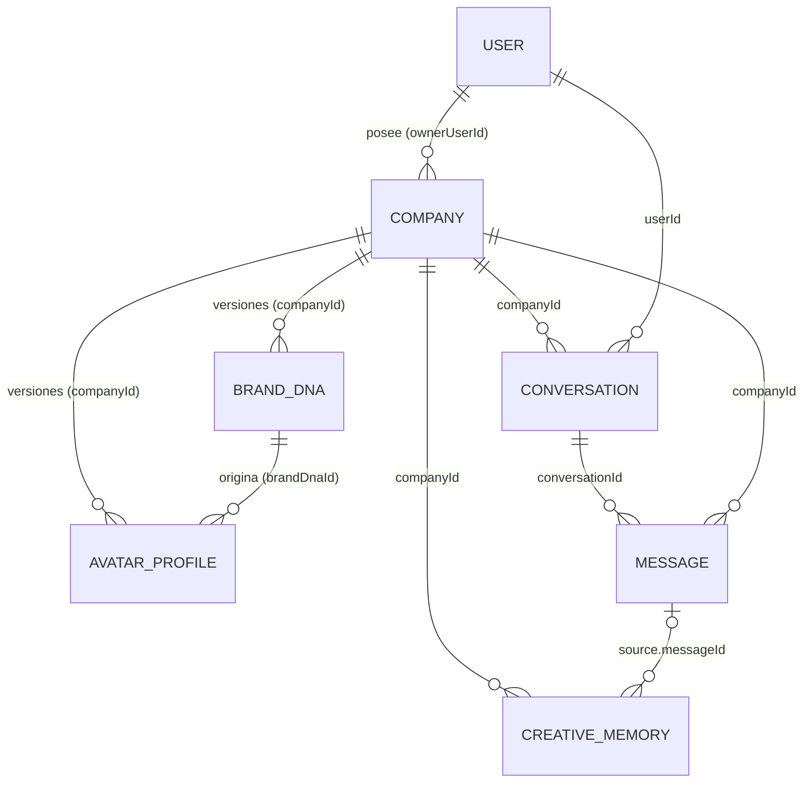

# Entidades — Pixel MVP 0.1

Las entidades se definen como **schemas Zod en `packages/contracts`** (fuente de verdad) y se
persisten con **modelos Mongoose en `apps/api`**. Los IDs viajan como `string` (ObjectId hex) en los contratos.

Convenciones comunes:

- Todas tienen `id`, `createdAt`, `updatedAt` (en Mongo: `_id` + `timestamps: true`).
- **Entidades de empresa** (`BrandDNA`, `AvatarProfile`, `Conversation`, `Message`, `CreativeMemory`)
  tienen `companyId` **requerido e indexado** y usan el plugin `tenantScoped`.
- `User` y `Company` son las raíces: `Company.ownerUserId` define el acceso.

## Diagrama



---

## 1. User

Persona que usa Pixel. No pertenece a una empresa (puede tener varias).

| Campo | Tipo | Reglas |
|---|---|---|
| `email` | string | Único, minúsculas, formato email |
| `passwordHash` | string | bcrypt. **Nunca** sale en DTOs |
| `name` | string | 1–80 caracteres |

Índices: `{ email: 1 }` único.

## 2. Company

Empresa cuyo Pixel se construye. Contiene el **onboarding crudo** como subdocumento (no es una
entidad aparte en 0.1).

| Campo | Tipo | Reglas |
|---|---|---|
| `ownerUserId` | ObjectId → User | Requerido. Único dueño en 0.1 |
| `name` | string | 1–120 |
| `industry` | string | Opcional al crear; requerido al enviar onboarding |
| `status` | `draft \| onboarding \| analyzing \| ready \| failed` | Ver máquina de estados en `MVP.md` |
| `onboarding.data` | `BrandOnboardingInput` (parcial en borrador) | Validación completa solo al enviar |
| `onboarding.submittedAt` | Date \| null | |
| `analysis.startedAt` / `finishedAt` | Date \| null | |
| `analysis.attempts` | number | |
| `analysis.error` | `{ code, message } \| null` | Mensaje apto para el usuario |
| `activeBrandDnaId` | ObjectId \| null | Versión vigente |
| `activeAvatarProfileId` | ObjectId \| null | Versión vigente |

Índices: `{ ownerUserId: 1, createdAt: -1 }`, `{ status: 1, 'analysis.startedAt': 1 }` (recuperación de jobs).

### BrandOnboardingInput (contrato, embebido en Company)

| Campo | Requerido | Descripción |
|---|---|---|
| `companyName` | ✔ | Nombre comercial |
| `industry` | ✔ | Sector |
| `location` | | País/ciudad (origen puede ser rasgo de marca) |
| `description` | ✔ | Qué hace la empresa (texto libre, ≤ 2000) |
| `offering` | | Productos/servicios principales (lista) |
| `audience` | ✔ | A quién se dirige (texto) |
| `mission` / `vision` | | |
| `values` | | Lista de valores |
| `personalityWords` | ✔ | 3–5 palabras que describen la marca |
| `antiPersonalityWords` | | Lo que la marca **no** es |
| `toneExamples` | | Frases de ejemplo de cómo habla (o hablaría) la marca |
| `differentiators` | | Qué la hace distinta |
| `references` | | Marcas que admiran / competidores |
| `brandColors` | | Lista de colores hex existentes |
| `visualLikes` / `visualDislikes` | | Estéticas que gustan / que rechazan |
| `wordsToAvoid` | | Vocabulario prohibido |
| `websiteUrl` | | Solo se guarda (sin scraping en 0.1) |
| `notes` | | Cualquier contexto adicional |

---

## 3. BrandDNA — lo que la empresa **ES**

Generado por `BrandAnalysisService` a partir del onboarding. Versionado: cada regeneración crea
una versión nueva; la vigente está referenciada en `Company.activeBrandDnaId`.

| Bloque | Campos | Uso principal |
|---|---|---|
| **meta** | `companyId`, `version`, `generatedBy { provider, model, promptVersion }` | Trazabilidad |
| **identity** | `name`, `industry`, `essence` (una frase), `mission?`, `vision?`, `values[{ name, meaning }]`, `story?`, `offering[]`, `differentiators[]` | Conocimiento estructurado |
| **audience** | `segments[{ name, description, needs[] }]`, `insights[]` | Conocimiento estructurado |
| **personality** | `archetype` (enum de 12 arquetipos de marca: `creator`, `caregiver`, `explorer`, `sage`, `hero`, `magician`, `rebel`, `lover`, `jester`, `everyman`, `ruler`, `innocent`), `traits[{ name, intensity: 1–5, expression }]`, `antiTraits[]` | Personalidad |
| **voice** | `summary`, `language` (ej. `es`), `toneScales { formalCasual, seriousPlayful, rationalEmotional, traditionalInnovative, reservedExpressive }` (0–100), `vocabulary { preferred[], avoid[] }`, `do[]`, `dont[]`, `samplePhrases[]` | Estilo de comunicación |
| **creativeCriteria** | `principles[]`, `goodIdeaTests[]` ("una idea es buena para esta marca si…"), `redFlags[]` | Criterio creativo |
| **visualDirection** | `palette[{ hex, name, role: primary\|secondary\|accent\|neutral }]`, `moodKeywords[]`, `shapeLanguage: organic\|geometric\|structural\|fluid\|soft`, `materials[]`, `imageryStyle`, `typographyMood` | Dirección visual (insumo del avatar) |
| **behavior** | `roleStatement` (cómo actúa Pixel como director creativo de esta marca), `feedbackStyle`, `proactivity: low\|medium\|high`, `boundaries[]` | Comportamiento |
| **confidence** | `overall` (0–1), `gaps[]` (información faltante que Pixel debería preguntar) | Honestidad del análisis |

Índices: `{ companyId: 1, version: -1 }` único.

## 4. AvatarProfile — cómo esa identidad **se ve** como Pixel

Generado por `AvatarDesignService` **exclusivamente a partir del BrandDNA**. Todos los valores
visuales pertenecen a catálogos cerrados que el renderer conoce.

| Bloque | Campos | Valores |
|---|---|---|
| **meta** | `companyId`, `brandDnaId`, `brandDnaVersion`, `version`, `generatedBy` | |
| **concept** | `name` (nombre del Pixel de la empresa), `metaphor` (ej. "grano de café antropomórfico"), `summary` | texto |
| **form** | `archetype` | `seed` · `crystal` · `block` · `blob` · `drop` · `capsule` |
| | `proportions { width, height, depth }` | 0.6–1.4 (factores de escala) |
| | `roundness` | 0–1 |
| | `surfaceDetail` | `none` · `center-groove` · `facets` · `panel-lines` · `grain` · `stripes` |
| **palette** | `body`, `secondary`, `accent`, `eyes`, `background` | hex |
| **material** | `style`, `roughness`, `metalness` | `matte` · `satin` · `glossy` · `metallic` · `clay` · `glass`; 0–1 |
| **face** | `eyeStyle`, `eyeSize`, `mouthStyle`, `eyebrows`, `blush` | `round` · `oval` · `visor` · `line` · `dot`; 0–1; `smile` · `line` · `open` · `none`; bool; bool |
| **expression** | `default` | `warm` · `neutral` · `confident` · `curious` · `playful` · `calm` |
| **motion** | `idle`, `energy` | `bounce` · `float` · `sway` · `breathe` · `hover-spin`; 0–1 |
| **lighting** | `mood` | `warm` · `cool` · `studio` · `dramatic` |
| **rationale** | `[{ attribute, value, reason, dnaReference }]` | Mínimo 5 entradas; `dnaReference` es una ruta del BrandDNA (ej. `visualDirection.shapeLanguage`) |

Índices: `{ companyId: 1, version: -1 }` único, `{ companyId: 1, brandDnaId: 1 }`.

### Ejemplo (café artesanal colombiano, abreviado)

```json
{
  "concept": { "name": "Pixel Origen", "metaphor": "Grano de café antropomórfico", "summary": "Cálido, cercano y orgulloso de su origen." },
  "form": { "archetype": "seed", "proportions": { "width": 0.9, "height": 1.15, "depth": 0.8 }, "roundness": 0.85, "surfaceDetail": "center-groove" },
  "palette": { "body": "#6B3E26", "secondary": "#A9714B", "accent": "#E8C07D", "eyes": "#1E120C", "background": "#F5EBDD" },
  "material": { "style": "satin", "roughness": 0.55, "metalness": 0.0 },
  "face": { "eyeStyle": "round", "eyeSize": 0.6, "mouthStyle": "smile", "eyebrows": true, "blush": true },
  "expression": { "default": "warm" },
  "motion": { "idle": "bounce", "energy": 0.35 },
  "lighting": { "mood": "warm" },
  "rationale": [
    { "attribute": "form.archetype", "value": "seed", "reason": "El producto central es el grano de café de origen.", "dnaReference": "identity.offering" },
    { "attribute": "palette.body", "value": "#6B3E26", "reason": "Tostado medio, color principal de la marca.", "dnaReference": "visualDirection.palette" },
    { "attribute": "expression.default", "value": "warm", "reason": "Rasgo 'calidez' con intensidad 5.", "dnaReference": "personality.traits" },
    { "attribute": "motion.energy", "value": "0.35", "reason": "Ritmo pausado, artesanal; no frenético.", "dnaReference": "voice.toneScales" },
    { "attribute": "material.style", "value": "satin", "reason": "Textura natural del grano tostado, sin brillo artificial.", "dnaReference": "visualDirection.materials" }
  ]
}
```

## 5. Conversation

| Campo | Tipo | Reglas |
|---|---|---|
| `companyId` | ObjectId → Company | Requerido, indexado |
| `userId` | ObjectId → User | Quien la creó |
| `title` | string | Derivado del primer mensaje o "Nueva conversación" |
| `lastMessageAt` | Date | |

Índices: `{ companyId: 1, lastMessageAt: -1 }`.

## 6. Message

| Campo | Tipo | Reglas |
|---|---|---|
| `companyId` | ObjectId | Requerido, indexado (redundante a propósito: aislamiento sin joins) |
| `conversationId` | ObjectId → Conversation | Debe pertenecer al mismo `companyId` |
| `role` | `user \| pixel` | |
| `content` | string | 1–8000 caracteres |
| `brandDnaVersion` | number \| null | Versión del ADN con la que respondió Pixel |
| `ai` | `{ provider, model, latencyMs, usage? } \| null` | Solo en mensajes de Pixel |

Índices: `{ companyId: 1, conversationId: 1, createdAt: 1 }`.

## 7. CreativeMemory

Conocimiento creativo acumulado de la empresa (preferencias, decisiones, rechazos). En 0.1 se crea
**solo de forma explícita** por el usuario; la extracción automática queda para después.

| Campo | Tipo | Reglas |
|---|---|---|
| `companyId` | ObjectId | Requerido, indexado |
| `kind` | `preference \| decision \| insight \| rejection` | |
| `content` | string | 1–1000 caracteres |
| `source` | `{ type: 'message' \| 'manual', conversationId?, messageId? }` | Referencias del mismo `companyId` |
| `createdByUserId` | ObjectId → User | |
| `active` | boolean | `DELETE` = desactivar |

Índices: `{ companyId: 1, active: 1, createdAt: -1 }`.

Uso en chat: las memorias activas más recientes (límite configurable) se incluyen en el system prompt
de `PixelChatService`, siempre filtradas por `companyId`.
