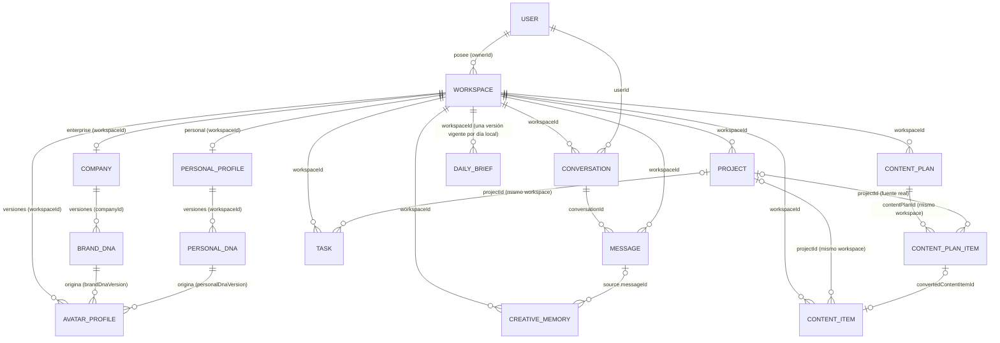

# Entidades — Pixel MVP 0.1

Las entidades se definen como **schemas Zod en `packages/contracts`** (fuente de verdad) y se
persisten con **modelos Mongoose en `apps/api`**. Los IDs viajan como `string` (ObjectId hex) en los contratos.

Convenciones comunes:

- Todas tienen `id`, `createdAt`, `updatedAt` (en Mongo: `_id` + `timestamps: true`).
- **Workspace es la frontera de aislamiento** (`docs/WORKSPACES.md`). Los recursos del workspace
  (`AvatarProfile`, `Conversation`, `Message`, `CreativeMemory`) y los de Pixel Personal
  (`PersonalProfile`, `PersonalDNA`) y de Operations (`Project`, `Task`, `ContentItem`) tienen
  `workspaceId` **requerido e indexado** y usan `tenantScoped` con clave `workspaceId`.
- `BrandDNA` es un dato propio de la empresa: `companyId` requerido y `tenantScoped` con clave
  `companyId`. Su workspace se deriva de `Company.workspaceId`.
- Raíces de acceso: `Workspace.ownerId` y `Company.ownerId` (legacy, igual al del workspace).
- Campos legacy que se conservan por compatibilidad: `Company.ownerId` y `companyId` en
  `AvatarProfile`, `Conversation` y `Message` (`docs/WORKSPACE-MIGRATION.md`).

## Diagrama

---

## 1. User

Persona que usa Pixel. No pertenece a una empresa (puede tener varias).

| Campo | Tipo | Reglas |
|---|---|---|
| `name` | string | 1–80 caracteres |
| `email` | string | Único, minúsculas, formato email |
| `passwordHash` | string | bcrypt (`bcryptjs`). `select: false`. **Nunca** sale en DTOs |
| `createdAt` / `updatedAt` | Date | Automáticos |

Índices: `{ email: 1 }` único. ✅ Implementado (`apps/api/src/modules/auth/user.model.ts`).

## 1b. Workspace ✅

Contenedor contextual de un Pixel: `enterprise` (una empresa) o `personal` (uno por usuario).
Campos, índices y reglas en [`WORKSPACES.md`](./WORKSPACES.md#modelo).

## 1c. PersonalProfile y PersonalDNA (Pixel Personal) ✅

`PersonalProfile` (`personal_profiles`, uno por workspace personal) guarda quién es la persona y el
borrador del onboarding de 8 pasos. `PersonalDNA` (`personal_dnas`, versionado) es lo que Pixel
entiende de ella: identidad, perfil profesional, objetivos, audiencia, personalidad, comunicación,
identidad creativa, contenido, forma de trabajar, ayuda que espera, preferencias y restricciones.
Entidad independiente de BrandDNA. Campos, índices, generación y reglas en
[`PERSONAL.md`](./PERSONAL.md#2-modelos).

## 1d. Project, Task y ContentItem (Operations) ✅

Capa operacional del workspace, **de cualquier tipo** (Personal o Enterprise): `Project`
(`projects`), `Task` (`tasks`) y `ContentItem` (`content_items`). Los tres llevan `workspaceId`
requerido y `tenantScoped` por `workspaceId`. Tasks y ContentItems pueden tener un `projectId`, que
siempre apunta a un Project del **mismo** workspace (lo verifica el servicio). `Project.progress` se
calcula, no se guarda. `completedAt`, `publishedAt` y `source` los gestiona el servidor. DELETE de un
proyecto lo archiva. Campos, estados, índices y reglas en [`OPERATIONS.md`](./OPERATIONS.md).

**Shared Workspace Operations (Prompt 12):** Enterprise usa los mismos tres modelos, sin
`companyId` (el workspace ya conoce su empresa) ni modelos `Enterprise*`. `Project.type` admite
`general · content · client · creative · study · personal · campaign · branding · product_launch ·
event · internal · other` (por defecto `general`; solo se añadieron valores, sin migración). Desde el
Prompt 13, Project y ContentItem tienen `campaignId` opcional (`null` por defecto, índice
`{workspaceId, campaignId}`, campaña del mismo workspace; Task no lo tiene). Ver
[`ENTERPRISE-OPERATIONS.md`](./ENTERPRISE-OPERATIONS.md). Las capacidades por tipo
(`WorkspaceCapabilities`) se derivan de `workspace.type`: no son una entidad ni un campo.

## 1g. Campaign, CampaignStrategy y CampaignDeliverable (Campaign Manager) ✅

Solo Enterprise (capacidad `campaigns`). Las tres llevan `workspaceId` obligatorio y `tenantScoped`.
`Campaign` (`campaigns`) es la entidad estratégica: objetivo, brief, estado (`draft` · `planned` ·
`active` · `paused` · `completed` · `archived`), `generatedBy`, `brandDnaVersion` y el puntero
`currentStrategyVersion`; DELETE la archiva. `CampaignStrategy` (`campaign_strategies`) es una
versión de su estrategia (único `{workspaceId, campaignId, version}`; nunca se sobrescribe).
`CampaignDeliverable` (`campaign_deliverables`) es una pieza que la campaña necesita
(`proposed` · `accepted` · `rejected` · `converted`): al aceptarla se crea un ContentItem
(`type content`) o un Project (el resto) con `campaignId`, una sola vez (`convertedContentItemId` /
`convertedProjectId`). Detalle en [`CAMPAIGNS.md`](./CAMPAIGNS.md).

## 1e. ContentPlan y ContentPlanItem (Content Planner) ✅

`ContentPlan` (`content_plans`) es la estrategia de un periodo (máx. 30 días), con sus pilares, sus
plataformas y su `personalDnaVersion`. `ContentPlanItem` (`content_plan_items`) es una **propuesta**
justificada (`rationale`), no una pieza en producción: al aceptarla se crea un ContentItem
(`source pixel`, `status idea`) y la propuesta queda `converted` con `convertedContentItemId`.
Ambos son recursos del workspace (`tenantScoped` por `workspaceId`). Generar con Pixel solo está
disponible en Personal. Detalle en [`CONTENT-PLANNER.md`](./CONTENT-PLANNER.md).

## 1f. DailyBrief (Daily Director) ✅

`DailyBrief` (`daily_briefs`) es la dirección del día de un workspace: resumen, hasta 3
prioridades, avisos, sugerencia de contenido y bloques de enfoque. Es un resultado **derivado**:
no se edita; regenerar crea la versión siguiente del día (`{ workspaceId, localDate, version }`
único) y se devuelve siempre la última. Guarda `contextSnapshotAt` y una huella de conteos para
marcar `stale`. Es un recurso del workspace (`tenantScoped`, `contextType`), y hoy solo se genera en
Personal.

`Workspace.timezone` (IANA, opcional; fallback `DEFAULT_TIMEZONE`) define el "hoy". Detalle en
[`DAILY-DIRECTOR.md`](./DAILY-DIRECTOR.md).

## 2. Company

Empresa cuyo Pixel se construye (Pixel Enterprise). Pertenece a un workspace enterprise
(`workspaceId`, único: 1 empresa por workspace). Contiene el **onboarding crudo** como subdocumento (no es una
entidad aparte en 0.1).

| Campo | Tipo | Reglas |
|---|---|---|
| `workspaceId` | ObjectId → Workspace | Workspace enterprise (índice único parcial). Las empresas anteriores a los workspaces lo reciben al migrarse ✅ |
| `ownerId` | ObjectId → User | Requerido. Legacy: igual al dueño del workspace. Siempre sale de la sesión, nunca del body ✅ |
| `name` | string | 2–120 ✅ |
| `slug` | string | Generado del nombre (`cafe-tinto`), único por dueño (`cafe-tinto-2`…). No cambia al renombrar ✅ |
| `industry` | string | 2–80, requerido ✅ |
| `description` | string | 0–2000, por defecto `''` ✅ |
| `logoUrl` | string \| null | URL http(s) opcional ✅ |
| `status` | `draft \| onboarding \| analyzing \| ready \| failed` | Por defecto `draft`. No editable por PATCH. Ver máquina de estados en `MVP.md` ✅ |
| `createdAt` / `updatedAt` | Date | Automáticos ✅ |
| `onboarding.data` | `BrandOnboardingInput` (parcial en borrador) | Validación completa solo al enviar |
| `onboarding.submittedAt` | Date \| null | |
| `analysis.startedAt` / `finishedAt` | Date \| null | |
| `analysis.attempts` | number | |
| `analysis.error` | `{ code, message } \| null` | Mensaje apto para el usuario |
| `onboarding` | `{ answers, updatedAt }` | Ver "Onboarding de marca" ✅ |
| `brandDnaVersion` | number \| null | Versión vigente del BrandDNA ✅ |
| `avatarVersion` | number \| null | Versión vigente del AvatarProfile ✅ |
| `activeAvatarProfileId` | ObjectId \| null | Versión vigente |

Índices: `{ ownerId: 1, createdAt: -1 }`, `{ ownerId: 1, slug: 1 }` único ✅; `{ status: 1, 'analysis.startedAt': 1 }` (recuperación de jobs, Etapa 6).

✅ = implementado. Los campos `onboarding.*`, `analysis.*` y `active*Id` llegan en las Etapas 4 y 6.

### Onboarding de marca (embebido en `Company.onboarding`) ✅

`Company.onboarding = { answers: { <paso>: <datos> }, updatedAt }`. Cada paso se valida completo con
su schema de `packages/contracts/src/brandOnboarding.ts` al guardarse (`PUT /brand-dna`) y al leerse
(un paso inválido se descarta y vuelve a quedar pendiente). Los pasos completados se derivan de las
respuestas presentes. Las listas se recortan y deduplican (sin distinguir mayúsculas).

| Paso | Campos (requeridos en **negrita**) |
|---|---|
| `company` | **name**, **industry**, **description**, **history**, origin (opcional). Sincroniza name/industry/description de la empresa |
| `purpose` | **mission**, **vision**, **purpose**, **values[]** (1–8) |
| `audience` | **targetAudience**, **needs[]**, **problems[]**, **characteristics[]** (≥ 1 cada una) |
| `personality` | **attributes[]** (3–10, sugerencias o texto libre; el orden indica importancia) |
| `communication` | **tone[]** (1–6), **formality** (1–5), **energy** (1–5), **language** (`es`, `en`, `pt`, `fr`, `it`, `de`), wordsToUse[], wordsToAvoid[] |
| `visual` | **colors[]** (1–8, `{ hex, name? }`), **styles[]**, materials[], **shapes[]**, references[], recurringElements[], avoid[] |
| `competition` | competitors[], **differentiators[]** |
| `creative` | **likes[]**, dislikes[], visualReferences[], restrictions[] |

## 3. BrandDNA — lo que la empresa **ES** ✅

Colección `brand_dnas`. Schema: `BrandDnaContentSchema` / `BrandDnaSchema` en
`packages/contracts/src/brandDna.ts` (fuente de verdad, validada al escribir y al leer).

**Generación (fase actual): determinística, sin IA** (`apps/api/src/modules/brand-dna/brandDna.generator.ts`,
versión de reglas `rules-1`). Mismas respuestas → mismo ADN. Se genera cuando los 8 pasos están
completos; cada cambio posterior en las respuestas crea una **versión nueva** (historial). Si las
respuestas no cambian (`sourceHash`), no se crea versión. La vigente está en `Company.brandDnaVersion`.
Cuando exista la capa de IA, `generator.kind` pasará a `ai` con el mismo contrato.

| Bloque | Campos | Cómo se obtiene (reglas) |
|---|---|---|
| **meta** | `companyId`, `version`, `generator { kind, version }`, `sourceHash`, `createdAt` | — |
| **identity** | `name`, `industry`, `description`, `story`, `origin`, `essence` | `essence` = "{nombre} es una marca {3 primeros atributos} de {sector}, con origen en {origen}." |
| **purpose** | `mission`, `vision`, `purpose`, `values[]` | Directo del paso 2 |
| **audience** | `summary`, `needs[]`, `problems[]`, `characteristics[]` | Directo del paso 3 |
| **personality** | `traits[{ label, weight 0–1, recognized }]`, `dimensions { innovation, sophistication, warmth, playfulness, energy }` (0–100) | Peso por orden. Léxico de rasgos (`brandDna.lexicon.ts`, insensible a tildes/género/número) → ejes; la formalidad empuja la sofisticación; la energía viene del paso 5 |
| **archetypes** | `primary`, `secondary \| null`, `ranking[]` — cada uno `{ id, score 0–100, signals[] }` | Afinidad del léxico × peso del rasgo (+ tono al 50 %). 12 arquetipos (`BRAND_ARCHETYPES`). Sin señales → `everyman`. Secundario si score ≥ 40 |
| **communication** | `tone[]`, `formality { level, label }`, `energy { level, label }`, `language { code, name }`, `vocabulary { preferred[], avoid[] }`, `guidelines { do[], dont[] }` | Pautas derivadas de tono, formalidad, energía, idioma y vocabulario |
| **visualLanguage** | `palette[{ hex, name, role, temperature, luminance }]`, `temperature`, `styles[]`, `materials[]`, `shapes[]`, `shapeLanguage`, `references[]`, `recurringElements[]` | Roles: los colores cromáticos en orden → primary, secondary, accent, support; grises/blancos rotos → neutral. Temperatura por tono (HSL). `shapeLanguage` por votos de formas (×1) y estilos (×0,5): organic/geometric/structural/fluid/soft/mixed |
| **differentiators** | `statements[]`, `competitors[]` | Paso 7 |
| **creativePreferences** | `likes[]`, `dislikes[]`, `visualReferences[]` | Paso 8 |
| **restrictions** | `creative[]`, `words[]`, `visual[]` | Consolidado de restricciones (paso 8), palabras a evitar (paso 5) y elementos visuales a evitar (paso 6) |

Índices: `{ companyId: 1, version: -1 }` único. Plugin `tenantScoped`: toda consulta exige `companyId`.

## 4. AvatarProfile — cómo esa identidad **se ve** como Pixel ✅

Colección `avatar_profiles` (plugin `tenantScoped`). Contrato: `AvatarConceptSchema` /
`AvatarProfileSchema` en `packages/contracts/src/avatarProfile.ts`. Es un **concepto de personaje**,
no un modelo 3D. Lo produce el **Avatar Concept Engine** a partir del ADN vigente (nunca del
onboarding crudo): el BrandDNA en Enterprise (`sourceType: brand`) o el PersonalDNA en Personal
(`sourceType: personal`, motor `PersonalAvatarConceptEngine`, ver [`PERSONAL.md`](./PERSONAL.md#6-avatar-personal)).
Cada generación crea una versión nueva; la vigente está en `Company.avatarVersion` o en
`PersonalProfile.avatarVersion`.

| Campo | Contenido |
|---|---|
| meta | `workspaceId`, `sourceType` (`brand` \| `personal`), `companyId` (legacy; obligatorio si `brand`, ausente si `personal`), `version`, `brandDnaVersion` (si `brand`) o `personalDnaVersion` (si `personal`): ADN del que salió, `engine { kind, version, variation }`, `createdAt` |
| `name` | Nombre conceptual ("Grano Anfitrión") |
| `avatarType` | Marca: `anthropomorphic_object` · `creature` · `geometric_entity` · `structural_character` · `organic_character`. Compartido: `abstract_character`. Personal: `stylized_human` · `creative_companion` · `tech_character` · `object_inspired` |
| `concept` | Descripción del personaje |
| `baseObject` | `{ id, label }` del catálogo de sujetos (`coffee_bean`, `crystal_core`, `building_block`…) o forma abstracta |
| `bodyShape` | `rounded` · `oval` · `teardrop` · `faceted` · `blocky` · `capsule` · `organic_irregular` |
| `proportions` | `width`, `height`, `depth`, `faceScale` (0.5–1.5), `stance` (`grounded`/`balanced`/`floating`) |
| `faceStyle` · `eyesStyle` · `mouthStyle` | Enums cerrados (ver contrato) |
| `primaryColor` · `secondaryColor` · `accentColor` | `{ hex, name }` con nombre descriptivo ("Tostado (marrón café)") |
| `materials` · `accessories` · `personalityTraits` | Listas de texto |
| `animationPersonality` | `friendly_expressive` · `calm_grounded` · `precise_efficient` · `playful_bouncy` · `elegant_smooth` · `bold_energetic` · `wise_measured` |
| `idleBehavior` | `{ animation, energy 0–1, description }` |
| `speakingBehavior` | `{ pace, gestures[], description }` |
| `expressiveness` | 0–100 |
| `visualKeywords` · `avoid` | Listas de texto |
| `rationale` | `{ summary, decisions[{ attribute, value, reason, sources[] }] }` — `sources` son rutas del ADN de origen (BrandDNA o PersonalDNA) |
| `renderHints` | `{ archetype (seed/crystal/block/blob/drop/capsule), roundness, finish, surfaceDetail }` para el renderer 3D |

Índices: `{ workspaceId: 1, version: -1 }` único parcial, `{ workspaceId: 1, brandDnaVersion: 1 }`,
`{ workspaceId: 1, personalDnaVersion: 1 }` parcial; compatibilidad Enterprise **parcial** (solo
documentos con `companyId`): `brand_company_version` (`{ companyId, version: -1 }` único) y
`brand_company_dna_version`. Sustituyen a los legacy no parciales `companyId_1_version_-1` y
`companyId_1_brandDnaVersion_1`, que `upgradeAvatarProfileIndexes()` retira al arrancar la API
([`PERSONAL.md` §11](./PERSONAL.md#11-índices-de-avatarprofile)).

### Avatar Concept Engine

Interfaz `AvatarConceptEngine` (`apps/api/src/modules/avatars/engine/`):
`generate({ brandDna, variation }) → AvatarConcept`. El servicio valida siempre la salida con Zod,
así que un motor de IA puede reemplazar o envolver al de reglas sin cambiar nada más.

Motor actual: `avatar-rules-1` (determinístico). Etapas:

1. **Sujeto**: cada sujeto del catálogo (`catalog.ts`) se puntúa con evidencia textual del ADN
   (sector ×4, elementos recurrentes ×2,5, descripción ×2, historia ×1,5, diferenciadores y
   materiales ×1, valores/público/preferencias ×0,5) más afinidades (lenguaje de formas,
   arquetipo, temperatura de paleta). Restricciones y "no le gusta" pueden **vetar** un sujeto.
   Sin evidencia suficiente → forma abstracta derivada del lenguaje de formas.
2. **Cuerpo** (proporciones, postura, redondez) según sujeto, formas y ejes de personalidad.
3. **Rostro** según calidez, juego, sofisticación, innovación y arquetipo.
4. **Color**: roles de la paleta del ADN, con nombres descriptivos.
5. **Materiales y accesorios**: acabado desde materiales principales y estilo; accesorios desde el
   sujeto, elementos recurrentes y origen, filtrados por lo que se debe evitar.
6. **Personalidad y comportamiento**: rasgos por arquetipo, personalidad de animación, reposo,
   habla y expresividad.
7. **Palabras clave y límites**.
8. **Rationale**: resumen y cada decisión con sus fuentes en el ADN.

**Regenerar**: la variación es el número de avatares ya generados para ese ADN. La 0 es el mejor
ajuste; las siguientes recorren alternativas viables (≥ 60 % del mejor) y la forma abstracta.

## 5. Conversation ✅

Colección `conversations` (plugin `tenantScoped`). Contrato: `ConversationSchema`.

| Campo | Tipo | Reglas |
|---|---|---|
| `workspaceId` | ObjectId → Workspace | Requerido, indexado (clave de aislamiento) |
| `contextType` | `enterprise \| personal` | Tipo del workspace: con qué contexto habla Pixel |
| `companyId` | ObjectId → Company | Legacy/enterprise (ausente en Personal) |
| `userId` | ObjectId → User | Quien conversa; las consultas filtran por `{ workspaceId, userId }` |
| `title` | string | Primer mensaje del usuario (60 caracteres) o "Nueva conversación" |
| `messageCount` | number | |
| `lastMessageAt` | Date \| null | |
| `createdAt` / `updatedAt` | Date | |

Índices: `{ workspaceId: 1, userId: 1, updatedAt: -1 }`.

## 6. Message ✅

Colección `messages` (plugin `tenantScoped`). Contrato: `MessageSchema`.

| Campo | Tipo | Reglas |
|---|---|---|
| `workspaceId` | ObjectId | Requerido (redundante a propósito: aislamiento sin joins) |
| `companyId` | ObjectId | Legacy/enterprise |
| `conversationId` | ObjectId → Conversation | Del mismo workspace |
| `userId` | ObjectId → User | Usuario de la conversación (también en los mensajes de Pixel) |
| `role` | `user \| pixel` | |
| `content` | string | Usuario: 1–4000 caracteres |
| `meta` | `{ provider, model, mode: ai\|demo, latencyMs, brandDnaVersion, personalDnaVersion, avatarVersion } \| null` | Solo en mensajes de Pixel: con qué ADN (de marca o personal; el otro es null), avatar y modelo respondió |
| `createdAt` | Date | |

Índices: `{ workspaceId: 1, conversationId: 1, createdAt: -1 }`.

## 7. CreativeMemory

Conocimiento creativo acumulado del workspace (preferencias, decisiones, rechazos). Hoy existen el
contrato (`CreativeMemorySchema`) y el modelo (`creative_memories`), sin endpoints; se creará **solo de
forma explícita** por el usuario y la extracción automática queda para después.

| Campo | Tipo | Reglas |
|---|---|---|
| `workspaceId` | ObjectId | Requerido, indexado (clave de aislamiento) |
| `memoryScope` | `enterprise \| personal` | |
| `companyId` | ObjectId | Enterprise (opcional) |
| `kind` | `preference \| decision \| insight \| rejection` | |
| `content` | string | 1–1000 caracteres |
| `source` | `{ type: 'message' \| 'manual', conversationId?, messageId? }` | Referencias del mismo `workspaceId` |
| `createdByUserId` | ObjectId → User | |
| `active` | boolean | `DELETE` = desactivar |

Índices: `{ workspaceId: 1, active: 1, createdAt: -1 }`.

Uso en chat: `EnterpriseContextBuilder` y `PersonalContextBuilder` incluyen las memorias activas más
recientes del workspace (máx. 10) en el system prompt, siempre filtradas por `workspaceId`. Hoy no se
crea ninguna desde la app.
