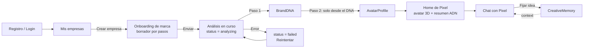
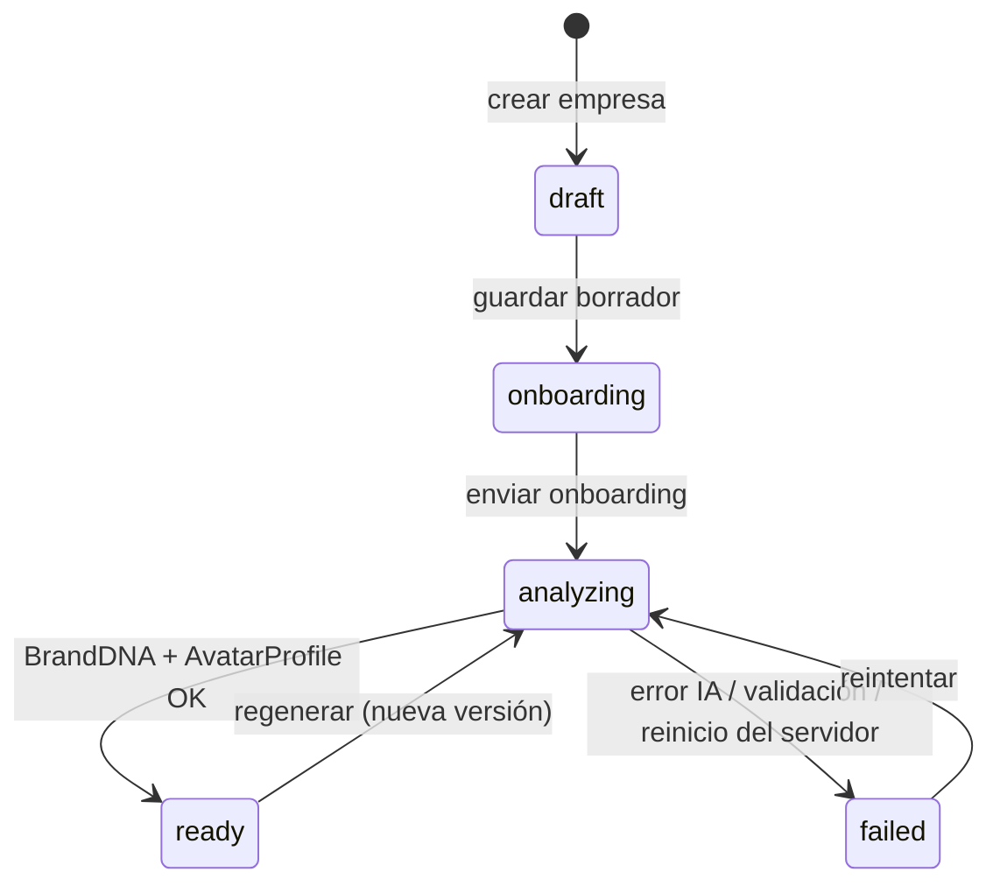

# Pixel — MVP 0.1

> Objetivo: **probar el concepto central**. Una empresa describe su marca, Pixel la entiende,
> se convierte en un personaje 3D coherente con esa marca y conversa como su director creativo.

Documentos relacionados: [`ARCHITECTURE.md`](./ARCHITECTURE.md) · [`ENTITIES.md`](./ENTITIES.md) · [`BACKLOG.md`](./BACKLOG.md)

---

## 1. Hipótesis que el MVP debe validar

1. A partir de un onboarding breve, la IA puede producir un **BrandDNA** estructurado, útil y
   reconocible por el dueño de la marca ("sí, esa es mi empresa").
2. Ese BrandDNA puede traducirse a un **AvatarProfile** cuyo resultado visual se percibe como
   **consecuencia de la marca**, no como una mascota genérica. Cada decisión visual es explicable.
3. Un chat alimentado por el BrandDNA responde con **la voz, el criterio y el comportamiento** de
   esa marca, de forma distinguible entre dos empresas diferentes.

## 2. Alcance

### Incluido

| Área | Qué incluye en 0.1 |
|---|---|
| Autenticación | Registro y login con email + contraseña. Sesión con JWT en cookie httpOnly. Logout. |
| Empresas | Un usuario crea y lista sus empresas. Un dueño por empresa (sin equipos/roles). |
| Onboarding | Formulario por pasos con guardado de borrador. Solo texto y colores hex (sin subida de archivos, sin scraping de web). |
| Análisis | Generación asíncrona (en proceso) de BrandDNA y luego AvatarProfile, con estado consultable y reintento. |
| BrandDNA | Vista de lectura del ADN generado. Versionado simple (regenerar = nueva versión). |
| Avatar 3D | Render paramétrico con React Three Fiber a partir del AvatarProfile: forma base de catálogo, proporciones, paleta, material, rostro, expresión, animación idle y estados (idle / pensando / hablando). Vista de la *rationale* (por qué se ve así). |
| Chat | Conversaciones por empresa, mensajes persistidos, respuestas de Pixel con contexto de BrandDNA + memorias + historial. Respuesta completa (sin streaming). |
| CreativeMemory | Mínima: el usuario puede fijar un mensaje/idea como memoria, listarla y borrarla. Las memorias activas entran al contexto del chat. |
| IA | Interfaz `AIProvider`, `MockAIProvider` determinista y un adaptador de proveedor real (proveedor a confirmar). |

### Excluido explícitamente

Generación avanzada de modelos 3D, video, lip-sync avanzado, voz en tiempo real, campañas
automáticas, facturación, planes SaaS, panel administrativo complejo, analytics avanzados,
equipos/roles por empresa, subida de logos/archivos, scraping de sitios web, streaming de respuestas,
extracción automática de memorias, internacionalización.

## 3. Flujo completo del MVP

### 3.1 Paso a paso

Rutas del frontend: `/login`, `/dashboard`, `/companies` y, por empresa, `/company/:companyId`
(resumen), `/company/:companyId/brand`, `/company/:companyId/pixel`, `/company/:companyId/chat`.
La API mantiene el prefijo REST `/api/companies/:companyId/...`.

| # | Paso | Frontend (`apps/web`) | Backend (`apps/api`) | Resultado / estado |
|---|---|---|---|---|
| 1 | Registro | `/register` | `POST /api/auth/register` → crea `User` (hash bcrypt), emite cookie JWT | Usuario autenticado |
| 2 | Login | `/login` | `POST /api/auth/login` · `GET /api/auth/me` | Sesión activa |
| 3 | Crear empresa | `/companies` | `POST /api/companies` | `Company.status = draft` |
| 4 | Onboarding | `/company/:companyId/onboarding` (pasos: Identidad → Oferta y audiencia → Personalidad y voz → Visual → Revisión) | `PUT /api/companies/:companyId/onboarding` (borrador, validación parcial) | `status = onboarding` |
| 5 | Enviar onboarding | Botón "Que Pixel analice mi marca" | `POST /api/companies/:companyId/onboarding/submit` (validación completa) → lanza job en proceso, responde `202` | `status = analyzing` |
| 6 | Pixel analiza | `/company/:companyId/analysis` con avatar genérico "pensando" y polling cada 2 s a `GET /api/companies/:companyId` | `BrandAnalysisService` → `AIProvider.generateObject(BrandDNASchema)` | `BrandDNA v1` guardado |
| 7 | Genera AvatarProfile | (mismo polling) | `AvatarDesignService` recibe **solo el BrandDNA** → `generateObject(AvatarProfileSchema)` | `AvatarProfile v1` guardado, `status = ready` |
| 8 | Render del avatar | `/company/:companyId/pixel` — `<PixelAvatar profile={...} state="idle" />` + panel "Por qué me veo así"; `/company/:companyId/brand` — resumen del ADN | `GET /api/companies/:companyId/brand-dna` · `GET /api/companies/:companyId/avatar-profile` | Avatar visible |
| 9 | Abrir chat | `/company/:companyId/chat` | `POST /api/companies/:companyId/conversations` | Conversación creada |
| 10 | Conversar | Avatar en estado `thinking` mientras espera y `talking` al recibir | `POST /api/companies/:companyId/conversations/:cid/messages` → `PixelChatService` (ContextBuilder: BrandDNA + memorias + últimos N mensajes, todo filtrado por `companyId`) | Mensajes `user` y `pixel` persistidos |
| 11 | Fijar memoria (opcional) | Acción "Recordar esto" en un mensaje | `POST /api/companies/:companyId/memories` | Memoria activa usada en siguientes respuestas |

### 3.2 Estados de la empresa

- Si el servidor se reinicia durante un análisis, al arrancar marca como `failed` toda empresa que
  lleve en `analyzing` más del tiempo máximo configurado, para que el usuario pueda reintentar.
- El chat solo está disponible con `status = ready`.

## 4. Escenarios de demostración

El MVP se considera demostrable cuando estos tres casos producen avatares y voces claramente distintos
(se incluirán como datos semilla en la Etapa 10):

| Empresa | Rasgos esperados del ADN | Avatar esperado (consecuencia) |
|---|---|---|
| Café artesanal colombiano | Origen, calidez, oficio, cercanía | Arquetipo `seed`: grano de café antropomórfico, ranura central, marrones y crema, material satinado, ojos redondos, sonrisa, idle `bounce` suave |
| Startup tecnológica | Precisión, innovación, claridad | Arquetipo `crystal`: poliedro facetado, paleta fría con acento brillante, material glossy/metálico, ojos tipo visor, idle `float` |
| Constructora | Solidez, confianza, estructura | Arquetipo `block`: cuerpo sólido de volúmenes apilados, líneas de panel, tonos tierra/concreto con acento de seguridad, material mate, idle `breathe` firme |

## 5. Criterios de éxito (aceptación del MVP 0.1)

1. Un usuario nuevo completa el recorrido completo (registro → chat) sin intervención técnica.
2. Con `MockAIProvider`, el recorrido completo funciona sin claves de API (útil para dev y CI).
3. Con el proveedor real, los tres escenarios de demostración producen tres AvatarProfiles con
   arquetipo, paleta y movimiento distintos, y cada uno trae una `rationale` que cita rasgos del ADN.
4. Pixel responde en el idioma y la voz del BrandDNA; dos empresas responden distinto a la misma pregunta.
5. Tests automatizados prueban que un usuario no puede leer ni escribir datos de una empresa ajena
   y que el contexto de IA de una empresa no contiene datos de otra.
6. `typecheck`, `lint`, `test` y `build` pasan en todo el monorepo.

## 6. Decisiones pendientes (requieren confirmación)

| Decisión | Propuesta | Alternativa |
|---|---|---|
| Proveedor de IA real | Anthropic (Claude) vía SDK oficial, detrás de `AIProvider` | OpenAI u otro; el diseño lo permite sin cambiar el producto |
| Gestor de paquetes | npm workspaces (sin herramientas extra) | pnpm |
| Sesión | JWT en cookie httpOnly + proxy de Vite (mismo origen en dev) | Bearer token en `Authorization` |
| MongoDB en desarrollo | Instancia local o MongoDB Atlas vía `MONGODB_URI` | — |
| Tests de integración con Mongo | `mongodb-memory-server` (descarga un binario de MongoDB la primera vez) | Mongo real de pruebas vía `MONGODB_URI_TEST` |
